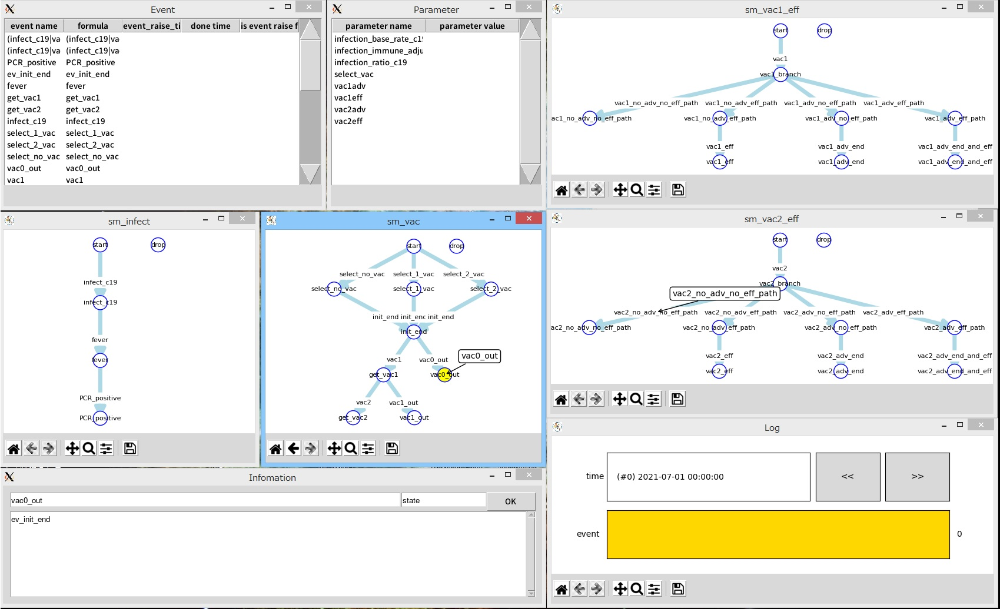
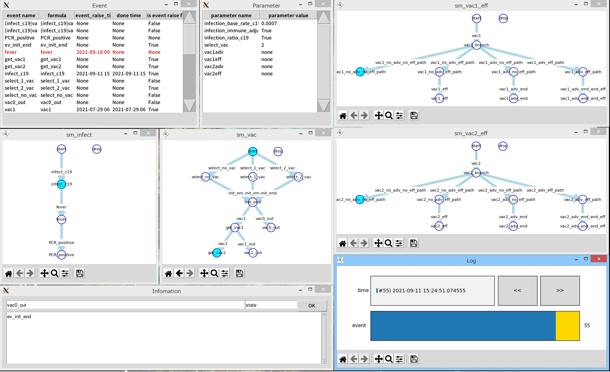
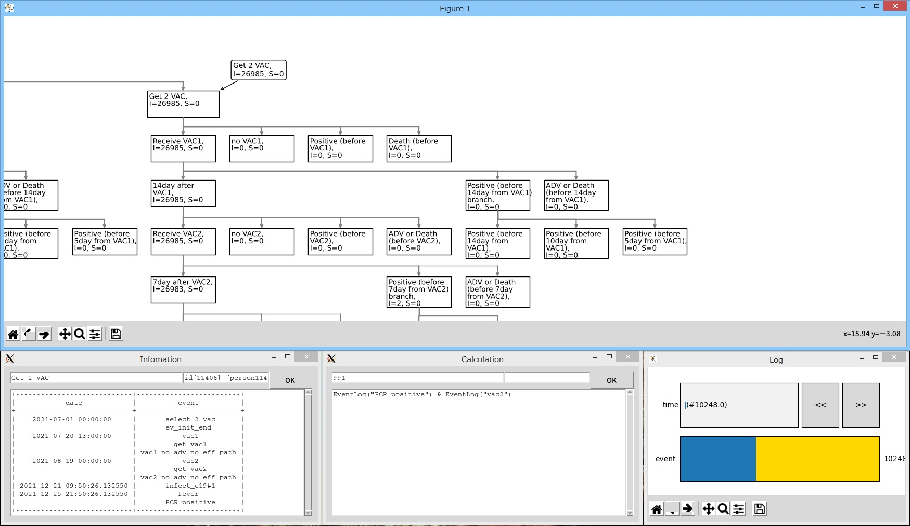

VEAME -- Vaccine Efficacy Analysis Method Evaluator
===================================================

VEAME is a python module which evaluates analysis methods of vaccine efficacy.
It is possible to simulate models of infection and vaccination by using provided classes.

Motivation
----------

Herd immunity is considered to be one of solutions to fight COVID-19.
Realizing immediately herd immunity depends on how effective vaccines are appropriately selected and used.
Therefore, demands to analize vaccine efficacy accurately and quickly for the appropriate vaccine strategy increase under situations that many kind of vaccine are developed all over the world.

There are some factors which complicate the analysis.
- Usually, vaccination is executed before an epidemic. However, infection of COVID-19 has been world-wide, and people can be infected before getting immunity.
- To get enough immunity, it is needed to get two shots, the booster and more.
- To minimizing the number of patients, it is needed to reduce the number of clinical test participants as much as possible.

To estimate vaccine efficacy accurately, the proper analysis method must be used.
The accuracy of analysis methods can be verified by comparing models and results derived from analysis methods and simulation data.
This program provides one method which evaluates the accuracy of analysis.
Knowledge obtained from evaluations by this program can be useful for selecting better analysis methods and improving them.
I hope this program will help people with suspicion about vaccine understand vaccine efficacy correctly.

Feature
-------

- Modeling infection and vaccination by state machine
- Simulation
- Evaluation of vaccine efficacy based on simulation data

Screenshot
----------

Model view



Replay of simulation result



Analysis of event data



Requirement
-----------

- python >= 3.2
- matplotlib >= 3.3.4
- networkx >= 2.5.1
- numpy >= 1.17.2
- pandas >= 1.1.5
- dill >= 0.3.4
- dominate >= 2.6.0
- markdownify
- prettytable >= 2.5.0

Usage
-----

```console
$ git clone https://github.com/schrodingers_koala/veame.git
$ cd veame
```

To run simulation:

```console
$ python ./examples/simple_model/vaceff_simple_model.py --task sim --config config_september_2021_no_adv.py --count 10000 --output sim.dat
```

To show result:

```console
$ python ./examples/simple_model/vaceff_simple_diagram.py --task show --input sim.dat
```

To show model:

```console
$ python ./examples/simple_model/vaceff_simple_model.py --task model_check --config config_september_2021_no_adv.py
```

Demo
----

- [Simple model](examples/simple_model/README.md)
- [Simple model with varying infection rate](examples/simple_model_with_varying_infection_rate/README.md)
- [Simple Model with 3rd Dose](examples/simple_model_with_3rd_dose/README.md)

License
-------

VEAME is under MIT license.
