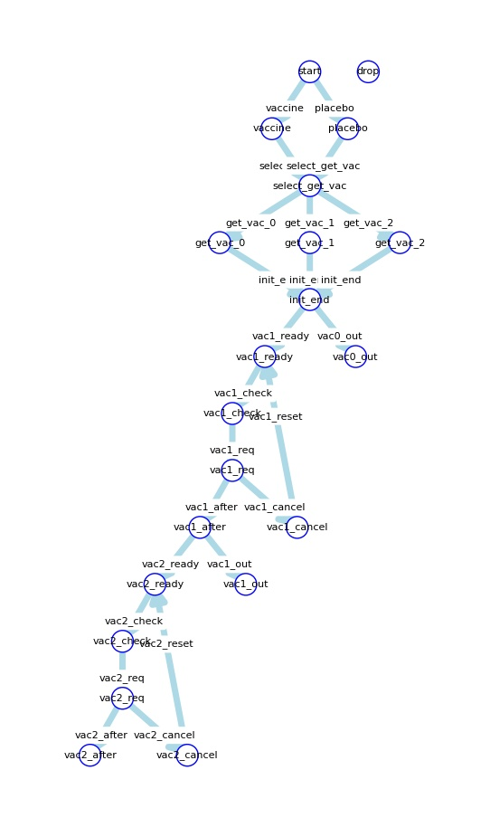
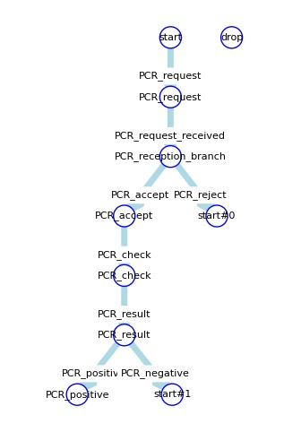
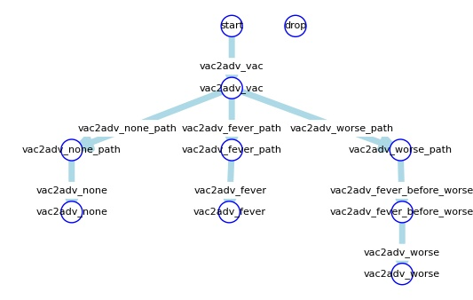
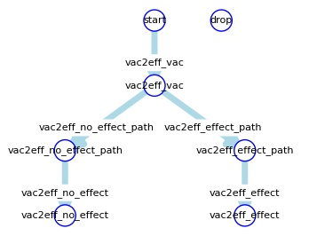
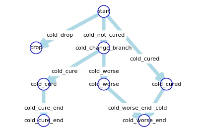
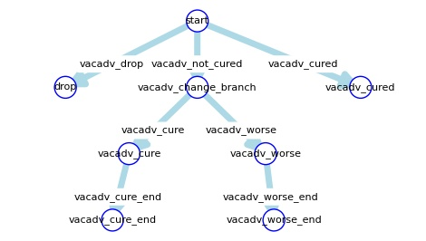
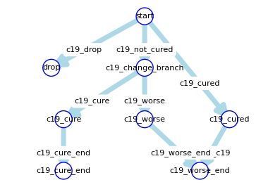
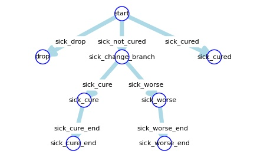
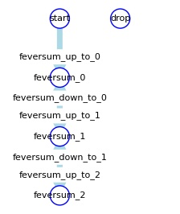
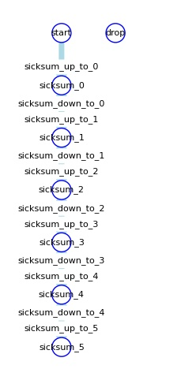

# Model Report

## sm\_vac

| trigger | state (from) | state (to) | event name | event formula |
| --- | --- | --- | --- | --- |
| vaccine | [start](#sm_vac_start) | [vaccine](#sm_vac_vaccine) | vaccine | [vaccine](#vaccine) |
| placebo | [start](#sm_vac_start) | [placebo](#sm_vac_placebo) | placebo | [placebo](#placebo) |
| select\_get\_vac | [vaccine](#sm_vac_vaccine) | [select\_get\_vac](#sm_vac_select_get_vac) | select\_get\_vac | [select\_get\_vac](#select_get_vac) |
| select\_get\_vac | [placebo](#sm_vac_placebo) | [select\_get\_vac](#sm_vac_select_get_vac) | select\_get\_vac | [select\_get\_vac](#select_get_vac) |
| get\_vac\_0 | [select\_get\_vac](#sm_vac_select_get_vac) | [get\_vac\_0](#sm_vac_get_vac_0) | get\_vac\_0 | [get\_vac\_0](#get_vac_0) |
| get\_vac\_1 | [select\_get\_vac](#sm_vac_select_get_vac) | [get\_vac\_1](#sm_vac_get_vac_1) | get\_vac\_1 | [get\_vac\_1](#get_vac_1) |
| get\_vac\_2 | [select\_get\_vac](#sm_vac_select_get_vac) | [get\_vac\_2](#sm_vac_get_vac_2) | get\_vac\_2 | [get\_vac\_2](#get_vac_2) |
| init\_end | [get\_vac\_0](#sm_vac_get_vac_0) | [init\_end](#sm_vac_init_end) | init\_end | [init\_end](#init_end) |
| init\_end | [get\_vac\_1](#sm_vac_get_vac_1) | [init\_end](#sm_vac_init_end) | init\_end | [init\_end](#init_end) |
| init\_end | [get\_vac\_2](#sm_vac_get_vac_2) | [init\_end](#sm_vac_init_end) | init\_end | [init\_end](#init_end) |
| vac1\_ready | [init\_end](#sm_vac_init_end) | [vac1\_ready](#sm_vac_vac1_ready) | vac1\_ready | [vac1\_ready](#vac1_ready) |
| vac0\_out | [init\_end](#sm_vac_init_end) | [vac0\_out](#sm_vac_vac0_out) | vac0\_out | [vac0\_out](#vac0_out) |
| vac1\_check | [vac1\_ready](#sm_vac_vac1_ready) | [vac1\_check](#sm_vac_vac1_check) | (~((on\_fever|on\_PCR\_positive))) | (~(([on\_fever](#on_fever)|[on\_PCR\_positive](#on_PCR_positive)))) |
| vac1\_req | [vac1\_check](#sm_vac_vac1_check) | [vac1\_req](#sm_vac_vac1_req) | vac1\_req | [vac1\_req](#vac1_req) |
| vac1\_after | [vac1\_req](#sm_vac_vac1_req) | [vac1\_after](#sm_vac_vac1_after) | vac1\_timer | [vac1\_timer](#vac1_timer) |
| vac1\_cancel | [vac1\_req](#sm_vac_vac1_req) | [vac1\_cancel](#sm_vac_vac1_cancel) | (on\_fever|on\_PCR\_positive) | ([on\_fever](#on_fever)|[on\_PCR\_positive](#on_PCR_positive)) |
| vac2\_ready | [vac1\_after](#sm_vac_vac1_after) | [vac2\_ready](#sm_vac_vac2_ready) | vac2\_ready | [vac2\_ready](#vac2_ready) |
| vac1\_out | [vac1\_after](#sm_vac_vac1_after) | [vac1\_out](#sm_vac_vac1_out) | vac1\_out | [vac1\_out](#vac1_out) |
| vac1\_reset | [vac1\_cancel](#sm_vac_vac1_cancel) | [vac1\_ready](#sm_vac_vac1_ready) | (~((on\_fever|on\_PCR\_positive))) | (~(([on\_fever](#on_fever)|[on\_PCR\_positive](#on_PCR_positive)))) |
| vac2\_check | [vac2\_ready](#sm_vac_vac2_ready) | [vac2\_check](#sm_vac_vac2_check) | (~((on\_fever|on\_PCR\_positive))) | (~(([on\_fever](#on_fever)|[on\_PCR\_positive](#on_PCR_positive)))) |
| vac2\_req | [vac2\_check](#sm_vac_vac2_check) | [vac2\_req](#sm_vac_vac2_req) | vac2\_req | [vac2\_req](#vac2_req) |
| vac2\_after | [vac2\_req](#sm_vac_vac2_req) | [vac2\_after](#sm_vac_vac2_after) | vac2\_timer | [vac2\_timer](#vac2_timer) |
| vac2\_cancel | [vac2\_req](#sm_vac_vac2_req) | [vac2\_cancel](#sm_vac_vac2_cancel) | (on\_fever|on\_PCR\_positive) | ([on\_fever](#on_fever)|[on\_PCR\_positive](#on_PCR_positive)) |
| vac2\_reset | [vac2\_cancel](#sm_vac_vac2_cancel) | [vac2\_ready](#sm_vac_vac2_ready) | (~((on\_fever|on\_PCR\_positive))) | (~(([on\_fever](#on_fever)|[on\_PCR\_positive](#on_PCR_positive)))) |

## sm\_pcr

| trigger | state (from) | state (to) | event name | event formula |
| --- | --- | --- | --- | --- |
| PCR\_request | [start](#sm_pcr_start) | [PCR\_request](#sm_pcr_PCR_request) | (on\_fever&pcr\_request\_not\_received) | ([on\_fever](#on_fever)&[pcr\_request\_not\_received](#pcr_request_not_received)) |
| PCR\_request\_received | [PCR\_request](#sm_pcr_PCR_request) | [PCR\_reception\_branch](#sm_pcr_PCR_reception_branch) | PCR\_request\_received | [PCR\_request\_received](#PCR_request_received) |
| PCR\_accept | [PCR\_reception\_branch](#sm_pcr_PCR_reception_branch) | [PCR\_accept](#sm_pcr_PCR_accept) | PCR\_accept | [PCR\_accept](#PCR_accept) |
| PCR\_reject | [PCR\_reception\_branch](#sm_pcr_PCR_reception_branch) | [start](#sm_pcr_start) | PCR\_reject | [PCR\_reject](#PCR_reject) |
| PCR\_check | [PCR\_accept](#sm_pcr_PCR_accept) | [PCR\_check](#sm_pcr_PCR_check) | PCR\_check | [PCR\_check](#PCR_check) |
| PCR\_result | [PCR\_check](#sm_pcr_PCR_check) | [PCR\_result](#sm_pcr_PCR_result) | PCR\_result | [PCR\_result](#PCR_result) |
| PCR\_positive | [PCR\_result](#sm_pcr_PCR_result) | [PCR\_positive](#sm_pcr_PCR_positive) | PCR\_positive | [PCR\_positive](#PCR_positive) |
| PCR\_negative | [PCR\_result](#sm_pcr_PCR_result) | [start](#sm_pcr_start) | PCR\_negative | [PCR\_negative](#PCR_negative) |

## sm\_vac1adv

| trigger | state (from) | state (to) | event name | event formula |
| --- | --- | --- | --- | --- |
| vac1adv\_vac | [start](#sm_vac1adv_start) | [vac1adv\_vac](#sm_vac1adv_vac1adv_vac) | vac1 | [vac1](#vac1) |
| vac1adv\_none\_path | [vac1adv\_vac](#sm_vac1adv_vac1adv_vac) | [vac1adv\_none\_path](#sm_vac1adv_vac1adv_none_path) | vac1adv\_none\_path | [vac1adv\_none\_path](#vac1adv_none_path) |
| vac1adv\_fever\_path | [vac1adv\_vac](#sm_vac1adv_vac1adv_vac) | [vac1adv\_fever\_path](#sm_vac1adv_vac1adv_fever_path) | vac1adv\_fever\_path | [vac1adv\_fever\_path](#vac1adv_fever_path) |
| vac1adv\_worse\_path | [vac1adv\_vac](#sm_vac1adv_vac1adv_vac) | [vac1adv\_worse\_path](#sm_vac1adv_vac1adv_worse_path) | vac1adv\_worse\_path | [vac1adv\_worse\_path](#vac1adv_worse_path) |
| vac1adv\_none | [vac1adv\_none\_path](#sm_vac1adv_vac1adv_none_path) | [vac1adv\_none](#sm_vac1adv_vac1adv_none) | vac1adv\_none | [vac1adv\_none](#vac1adv_none) |
| vac1adv\_fever | [vac1adv\_fever\_path](#sm_vac1adv_vac1adv_fever_path) | [vac1adv\_fever](#sm_vac1adv_vac1adv_fever) | vac1adv\_fever | [vac1adv\_fever](#vac1adv_fever) |
| vac1adv\_fever\_before\_worse | [vac1adv\_worse\_path](#sm_vac1adv_vac1adv_worse_path) | [vac1adv\_fever\_before\_worse](#sm_vac1adv_vac1adv_fever_before_worse) | vac1adv\_fever\_before\_worse | [vac1adv\_fever\_before\_worse](#vac1adv_fever_before_worse) |
| vac1adv\_worse | [vac1adv\_fever\_before\_worse](#sm_vac1adv_vac1adv_fever_before_worse) | [vac1adv\_worse](#sm_vac1adv_vac1adv_worse) | vac1adv\_worse | [vac1adv\_worse](#vac1adv_worse) |

## sm\_vac2adv

| trigger | state (from) | state (to) | event name | event formula |
| --- | --- | --- | --- | --- |
| vac2adv\_vac | [start](#sm_vac2adv_start) | [vac2adv\_vac](#sm_vac2adv_vac2adv_vac) | vac2 | [vac2](#vac2) |
| vac2adv\_none\_path | [vac2adv\_vac](#sm_vac2adv_vac2adv_vac) | [vac2adv\_none\_path](#sm_vac2adv_vac2adv_none_path) | vac2adv\_none\_path | [vac2adv\_none\_path](#vac2adv_none_path) |
| vac2adv\_fever\_path | [vac2adv\_vac](#sm_vac2adv_vac2adv_vac) | [vac2adv\_fever\_path](#sm_vac2adv_vac2adv_fever_path) | vac2adv\_fever\_path | [vac2adv\_fever\_path](#vac2adv_fever_path) |
| vac2adv\_worse\_path | [vac2adv\_vac](#sm_vac2adv_vac2adv_vac) | [vac2adv\_worse\_path](#sm_vac2adv_vac2adv_worse_path) | vac2adv\_worse\_path | [vac2adv\_worse\_path](#vac2adv_worse_path) |
| vac2adv\_none | [vac2adv\_none\_path](#sm_vac2adv_vac2adv_none_path) | [vac2adv\_none](#sm_vac2adv_vac2adv_none) | vac2adv\_none | [vac2adv\_none](#vac2adv_none) |
| vac2adv\_fever | [vac2adv\_fever\_path](#sm_vac2adv_vac2adv_fever_path) | [vac2adv\_fever](#sm_vac2adv_vac2adv_fever) | vac2adv\_fever | [vac2adv\_fever](#vac2adv_fever) |
| vac2adv\_fever\_before\_worse | [vac2adv\_worse\_path](#sm_vac2adv_vac2adv_worse_path) | [vac2adv\_fever\_before\_worse](#sm_vac2adv_vac2adv_fever_before_worse) | vac2adv\_fever\_before\_worse | [vac2adv\_fever\_before\_worse](#vac2adv_fever_before_worse) |
| vac2adv\_worse | [vac2adv\_fever\_before\_worse](#sm_vac2adv_vac2adv_fever_before_worse) | [vac2adv\_worse](#sm_vac2adv_vac2adv_worse) | vac2adv\_worse | [vac2adv\_worse](#vac2adv_worse) |

## sm\_vac1eff

| trigger | state (from) | state (to) | event name | event formula |
| --- | --- | --- | --- | --- |
| vac1eff\_vac | [start](#sm_vac1eff_start) | [vac1eff\_vac](#sm_vac1eff_vac1eff_vac) | vac1 | [vac1](#vac1) |
| vac1eff\_no\_effect\_path | [vac1eff\_vac](#sm_vac1eff_vac1eff_vac) | [vac1eff\_no\_effect\_path](#sm_vac1eff_vac1eff_no_effect_path) | vac1eff\_no\_effect\_path | [vac1eff\_no\_effect\_path](#vac1eff_no_effect_path) |
| vac1eff\_effect\_path | [vac1eff\_vac](#sm_vac1eff_vac1eff_vac) | [vac1eff\_effect\_path](#sm_vac1eff_vac1eff_effect_path) | vac1eff\_effect\_path | [vac1eff\_effect\_path](#vac1eff_effect_path) |
| vac1eff\_no\_effect | [vac1eff\_no\_effect\_path](#sm_vac1eff_vac1eff_no_effect_path) | [vac1eff\_no\_effect](#sm_vac1eff_vac1eff_no_effect) | vac1eff\_no\_effect | [vac1eff\_no\_effect](#vac1eff_no_effect) |
| vac1eff\_effect | [vac1eff\_effect\_path](#sm_vac1eff_vac1eff_effect_path) | [vac1eff\_effect](#sm_vac1eff_vac1eff_effect) | vac1eff\_effect | [vac1eff\_effect](#vac1eff_effect) |

## sm\_vac2eff

| trigger | state (from) | state (to) | event name | event formula |
| --- | --- | --- | --- | --- |
| vac2eff\_vac | [start](#sm_vac2eff_start) | [vac2eff\_vac](#sm_vac2eff_vac2eff_vac) | vac2 | [vac2](#vac2) |
| vac2eff\_no\_effect\_path | [vac2eff\_vac](#sm_vac2eff_vac2eff_vac) | [vac2eff\_no\_effect\_path](#sm_vac2eff_vac2eff_no_effect_path) | vac2eff\_no\_effect\_path | [vac2eff\_no\_effect\_path](#vac2eff_no_effect_path) |
| vac2eff\_effect\_path | [vac2eff\_vac](#sm_vac2eff_vac2eff_vac) | [vac2eff\_effect\_path](#sm_vac2eff_vac2eff_effect_path) | vac2eff\_effect\_path | [vac2eff\_effect\_path](#vac2eff_effect_path) |
| vac2eff\_no\_effect | [vac2eff\_no\_effect\_path](#sm_vac2eff_vac2eff_no_effect_path) | [vac2eff\_no\_effect](#sm_vac2eff_vac2eff_no_effect) | vac2eff\_no\_effect | [vac2eff\_no\_effect](#vac2eff_no_effect) |
| vac2eff\_effect | [vac2eff\_effect\_path](#sm_vac2eff_vac2eff_effect_path) | [vac2eff\_effect](#sm_vac2eff_vac2eff_effect) | vac2eff\_effect | [vac2eff\_effect](#vac2eff_effect) |

## sm\_cold

| trigger | state (from) | state (to) | event name | event formula |
| --- | --- | --- | --- | --- |
| cold\_not\_cured | [start](#sm_cold_start) | [cold\_change\_branch](#sm_cold_cold_change_branch) | cold\_not\_cured | [cold\_not\_cured](#cold_not_cured) |
| cold\_drop | [start](#sm_cold_start) | [drop](#sm_cold_drop) | cold\_drop | [cold\_drop](#cold_drop) |
| cold\_cured | [start](#sm_cold_start) | [cold\_cured](#sm_cold_cold_cured) | cold\_cured | [cold\_cured](#cold_cured) |
| cold\_cure | [cold\_change\_branch](#sm_cold_cold_change_branch) | [cold\_cure](#sm_cold_cold_cure) | cold\_cure | [cold\_cure](#cold_cure) |
| cold\_worse | [cold\_change\_branch](#sm_cold_cold_change_branch) | [cold\_worse](#sm_cold_cold_worse) | cold\_worse | [cold\_worse](#cold_worse) |
| infect\_cold | [cold\_cured](#sm_cold_cold_cured) | [cold\_worse\_end](#sm_cold_cold_worse_end) | infect\_cold | [infect\_cold](#infect_cold) |
| cold\_cure\_end | [cold\_cure](#sm_cold_cold_cure) | [cold\_cure\_end](#sm_cold_cold_cure_end) | cold\_cure\_end | [cold\_cure\_end](#cold_cure_end) |
| cold\_worse\_end | [cold\_worse](#sm_cold_cold_worse) | [cold\_worse\_end](#sm_cold_cold_worse_end) | cold\_worse\_end | [cold\_worse\_end](#cold_worse_end) |
| reset | - | [start](#sm_cold_start) | (+(cold\_val\_change)) | (+([cold\_val\_change](#cold_val_change))) |

## sm\_vacadv

| trigger | state (from) | state (to) | event name | event formula |
| --- | --- | --- | --- | --- |
| vacadv\_not\_cured | [start](#sm_vacadv_start) | [vacadv\_change\_branch](#sm_vacadv_vacadv_change_branch) | vacadv\_not\_cured | [vacadv\_not\_cured](#vacadv_not_cured) |
| vacadv\_drop | [start](#sm_vacadv_start) | [drop](#sm_vacadv_drop) | vacadv\_drop | [vacadv\_drop](#vacadv_drop) |
| vacadv\_cured | [start](#sm_vacadv_start) | [vacadv\_cured](#sm_vacadv_vacadv_cured) | vacadv\_cured | [vacadv\_cured](#vacadv_cured) |
| vacadv\_cure | [vacadv\_change\_branch](#sm_vacadv_vacadv_change_branch) | [vacadv\_cure](#sm_vacadv_vacadv_cure) | vacadv\_cure | [vacadv\_cure](#vacadv_cure) |
| vacadv\_worse | [vacadv\_change\_branch](#sm_vacadv_vacadv_change_branch) | [vacadv\_worse](#sm_vacadv_vacadv_worse) | vacadv\_worse | [vacadv\_worse](#vacadv_worse) |
| vacadv\_cure\_end | [vacadv\_cure](#sm_vacadv_vacadv_cure) | [vacadv\_cure\_end](#sm_vacadv_vacadv_cure_end) | vacadv\_cure\_end | [vacadv\_cure\_end](#vacadv_cure_end) |
| vacadv\_worse\_end | [vacadv\_worse](#sm_vacadv_vacadv_worse) | [vacadv\_worse\_end](#sm_vacadv_vacadv_worse_end) | vacadv\_worse\_end | [vacadv\_worse\_end](#vacadv_worse_end) |
| reset | - | [start](#sm_vacadv_start) | (+(vacadv\_val\_change)) | (+([vacadv\_val\_change](#vacadv_val_change))) |

## sm\_c19

| trigger | state (from) | state (to) | event name | event formula |
| --- | --- | --- | --- | --- |
| c19\_not\_cured | [start](#sm_c19_start) | [c19\_change\_branch](#sm_c19_c19_change_branch) | c19\_not\_cured | [c19\_not\_cured](#c19_not_cured) |
| c19\_drop | [start](#sm_c19_start) | [drop](#sm_c19_drop) | c19\_drop | [c19\_drop](#c19_drop) |
| c19\_cured | [start](#sm_c19_start) | [c19\_cured](#sm_c19_c19_cured) | c19\_cured | [c19\_cured](#c19_cured) |
| c19\_cure | [c19\_change\_branch](#sm_c19_c19_change_branch) | [c19\_cure](#sm_c19_c19_cure) | c19\_cure | [c19\_cure](#c19_cure) |
| c19\_worse | [c19\_change\_branch](#sm_c19_c19_change_branch) | [c19\_worse](#sm_c19_c19_worse) | c19\_worse | [c19\_worse](#c19_worse) |
| infect\_c19 | [c19\_cured](#sm_c19_c19_cured) | [c19\_worse\_end](#sm_c19_c19_worse_end) | infect\_c19 | [infect\_c19](#infect_c19) |
| c19\_cure\_end | [c19\_cure](#sm_c19_c19_cure) | [c19\_cure\_end](#sm_c19_c19_cure_end) | c19\_cure\_end | [c19\_cure\_end](#c19_cure_end) |
| c19\_worse\_end | [c19\_worse](#sm_c19_c19_worse) | [c19\_worse\_end](#sm_c19_c19_worse_end) | c19\_worse\_end | [c19\_worse\_end](#c19_worse_end) |
| reset | - | [start](#sm_c19_start) | (+(c19\_val\_change)) | (+([c19\_val\_change](#c19_val_change))) |

## sm\_sick

| trigger | state (from) | state (to) | event name | event formula |
| --- | --- | --- | --- | --- |
| sick\_not\_cured | [start](#sm_sick_start) | [sick\_change\_branch](#sm_sick_sick_change_branch) | sick\_not\_cured | [sick\_not\_cured](#sick_not_cured) |
| sick\_drop | [start](#sm_sick_start) | [drop](#sm_sick_drop) | sick\_drop | [sick\_drop](#sick_drop) |
| sick\_cured | [start](#sm_sick_start) | [sick\_cured](#sm_sick_sick_cured) | sick\_cured | [sick\_cured](#sick_cured) |
| sick\_cure | [sick\_change\_branch](#sm_sick_sick_change_branch) | [sick\_cure](#sm_sick_sick_cure) | sick\_cure | [sick\_cure](#sick_cure) |
| sick\_worse | [sick\_change\_branch](#sm_sick_sick_change_branch) | [sick\_worse](#sm_sick_sick_worse) | sick\_worse | [sick\_worse](#sick_worse) |
| sick\_cure\_end | [sick\_cure](#sm_sick_sick_cure) | [sick\_cure\_end](#sm_sick_sick_cure_end) | sick\_cure\_end | [sick\_cure\_end](#sick_cure_end) |
| sick\_worse\_end | [sick\_worse](#sm_sick_sick_worse) | [sick\_worse\_end](#sm_sick_sick_worse_end) | sick\_worse\_end | [sick\_worse\_end](#sick_worse_end) |
| reset | - | [start](#sm_sick_start) | (+(sick\_val\_change)) | (+([sick\_val\_change](#sick_val_change))) |

## sm\_feversum

| trigger | state (from) | state (to) | event name | event formula |
| --- | --- | --- | --- | --- |
| feversum\_up\_to\_0 | [start](#sm_feversum_start) | [feversum\_0](#sm_feversum_feversum_0) | feversum\_up\_to\_0 | [feversum\_up\_to\_0](#feversum_up_to_0) |
| feversum\_up\_to\_1 | [feversum\_0](#sm_feversum_feversum_0) | [feversum\_1](#sm_feversum_feversum_1) | feversum\_up\_to\_1 | [feversum\_up\_to\_1](#feversum_up_to_1) |
| feversum\_down\_to\_0 | [feversum\_1](#sm_feversum_feversum_1) | [feversum\_0](#sm_feversum_feversum_0) | feversum\_down\_to\_0 | [feversum\_down\_to\_0](#feversum_down_to_0) |
| feversum\_up\_to\_2 | [feversum\_1](#sm_feversum_feversum_1) | [feversum\_2](#sm_feversum_feversum_2) | feversum\_up\_to\_2 | [feversum\_up\_to\_2](#feversum_up_to_2) |
| feversum\_down\_to\_1 | [feversum\_2](#sm_feversum_feversum_2) | [feversum\_1](#sm_feversum_feversum_1) | feversum\_down\_to\_1 | [feversum\_down\_to\_1](#feversum_down_to_1) |

## sm\_sicksum

| trigger | state (from) | state (to) | event name | event formula |
| --- | --- | --- | --- | --- |
| sicksum\_up\_to\_0 | [start](#sm_sicksum_start) | [sicksum\_0](#sm_sicksum_sicksum_0) | sicksum\_up\_to\_0 | [sicksum\_up\_to\_0](#sicksum_up_to_0) |
| sicksum\_up\_to\_1 | [sicksum\_0](#sm_sicksum_sicksum_0) | [sicksum\_1](#sm_sicksum_sicksum_1) | sicksum\_up\_to\_1 | [sicksum\_up\_to\_1](#sicksum_up_to_1) |
| sicksum\_down\_to\_0 | [sicksum\_1](#sm_sicksum_sicksum_1) | [sicksum\_0](#sm_sicksum_sicksum_0) | sicksum\_down\_to\_0 | [sicksum\_down\_to\_0](#sicksum_down_to_0) |
| sicksum\_up\_to\_2 | [sicksum\_1](#sm_sicksum_sicksum_1) | [sicksum\_2](#sm_sicksum_sicksum_2) | sicksum\_up\_to\_2 | [sicksum\_up\_to\_2](#sicksum_up_to_2) |
| sicksum\_down\_to\_1 | [sicksum\_2](#sm_sicksum_sicksum_2) | [sicksum\_1](#sm_sicksum_sicksum_1) | sicksum\_down\_to\_1 | [sicksum\_down\_to\_1](#sicksum_down_to_1) |
| sicksum\_up\_to\_3 | [sicksum\_2](#sm_sicksum_sicksum_2) | [sicksum\_3](#sm_sicksum_sicksum_3) | sicksum\_up\_to\_3 | [sicksum\_up\_to\_3](#sicksum_up_to_3) |
| sicksum\_down\_to\_2 | [sicksum\_3](#sm_sicksum_sicksum_3) | [sicksum\_2](#sm_sicksum_sicksum_2) | sicksum\_down\_to\_2 | [sicksum\_down\_to\_2](#sicksum_down_to_2) |
| sicksum\_up\_to\_4 | [sicksum\_3](#sm_sicksum_sicksum_3) | [sicksum\_4](#sm_sicksum_sicksum_4) | sicksum\_up\_to\_4 | [sicksum\_up\_to\_4](#sicksum_up_to_4) |
| sicksum\_down\_to\_3 | [sicksum\_4](#sm_sicksum_sicksum_4) | [sicksum\_3](#sm_sicksum_sicksum_3) | sicksum\_down\_to\_3 | [sicksum\_down\_to\_3](#sicksum_down_to_3) |
| sicksum\_up\_to\_5 | [sicksum\_4](#sm_sicksum_sicksum_4) | [sicksum\_5](#sm_sicksum_sicksum_5) | sicksum\_up\_to\_5 | [sicksum\_up\_to\_5](#sicksum_up_to_5) |
| sicksum\_down\_to\_4 | [sicksum\_5](#sm_sicksum_sicksum_5) | [sicksum\_4](#sm_sicksum_sicksum_4) | sicksum\_down\_to\_4 | [sicksum\_down\_to\_4](#sicksum_down_to_4) |

## Event

| event name | event type | event info (some information omitted in md file) |
| --- | --- | --- |
| vac2 | StateEvent |  |
| vac2\_timer | TimerEvent |  |
| sick\_cure\_end | TimerEvent |  |
| sick\_worse\_end | TimerEvent |  |
| vacadv\_cure\_end | TimerEvent |  |
| vacadv\_worse\_end | TimerEvent |  |
| sick\_not\_cured | RandomEventChild |  |
| sick\_drop | RandomEventChild |  |
| vacadv\_not\_cured | RandomEventChild |  |
| sick\_cured | RandomEventChild |  |
| vacadv\_drop | RandomEventChild |  |
| sick\_cure | RandomEventChild |  |
| vacadv\_cured | RandomEventChild |  |
| sick\_worse | RandomEventChild |  |
| vacadv\_cure | RandomEventChild |  |
| sick\_val\_change | ParameterEvent |  |
| vacadv\_worse | RandomEventChild |  |
| vacadv\_val\_change | ParameterEvent |  |
| feversum\_up\_to\_0 | ParameterEvent |  |
| PCR\_request\_received | DummyEvent |  |
| PCR\_accept | RandomEventChild |  |
| PCR\_reject | RandomEventChild |  |
| PCR\_check | TimerEvent |  |
| feversum\_up\_to\_1 | ParameterEvent |  |
| PCR\_result | TimerEvent |  |
| feversum\_down\_to\_0 | ParameterEvent |  |
| PCR\_positive | RandomEventChild |  |
| PCR\_negative | RandomEventChild |  |
| on\_PCR\_positive | StateEvent |  |
| feversum\_up\_to\_2 | ParameterEvent |  |
| c19\_cure\_end | TimerEvent |  |
| feversum\_down\_to\_1 | ParameterEvent |  |
| c19\_worse\_end | TimerEvent |  |
| on\_fever | StateEvent |  |
| c19\_not\_cured | RandomEventChild |  |
| c19\_drop | RandomEventChild |  |
| c19\_cured | RandomEventChild |  |
| c19\_cure | RandomEventChild |  |
| c19\_worse | RandomEventChild |  |
| c19\_val\_change | ParameterEvent |  |
| infect\_c19 | StochasticEvent |  |
| sicksum\_up\_to\_0 | ParameterEvent |  |
| sicksum\_up\_to\_1 | ParameterEvent |  |
| vac1adv\_none\_path | RandomEventChild |  |
| vac1adv\_fever\_path | RandomEventChild |  |
| vac1adv\_worse\_path | RandomEventChild |  |
| sicksum\_down\_to\_0 | ParameterEvent |  |
| vac1adv\_none | TimerEvent |  |
| vac1adv\_fever | TimerEvent |  |
| vac1adv\_fever\_before\_worse | TimerEvent |  |
| placebo | RandomEventChild |  |
| vac1adv\_worse | TimerEvent |  |
| select\_get\_vac | DummyEvent |  |
| sicksum\_up\_to\_2 | ParameterEvent |  |
| sicksum\_down\_to\_1 | ParameterEvent |  |
| get\_vac\_0 | RandomEventChild |  |
| get\_vac\_1 | RandomEventChild |  |
| sicksum\_up\_to\_3 | ParameterEvent |  |
| get\_vac\_2 | RandomEventChild |  |
| vaccine | RandomEventChild |  |
| init\_end | DummyEvent |  |
| vac2eff\_no\_effect\_path | RandomEventChild |  |
| vac2eff\_effect\_path | RandomEventChild |  |
| sicksum\_down\_to\_2 | ParameterEvent |  |
| vac2eff\_no\_effect | TimerEvent |  |
| vac2eff\_effect | TimerEvent |  |
| sicksum\_up\_to\_4 | ParameterEvent |  |
| sicksum\_down\_to\_3 | ParameterEvent |  |
| vac1\_ready | ParameterEvent |  |
| vac2adv\_none\_path | RandomEventChild |  |
| vac0\_out | ParameterEvent |  |
| vac2adv\_fever\_path | RandomEventChild |  |
| sicksum\_up\_to\_5 | ParameterEvent |  |
| vac2adv\_worse\_path | RandomEventChild |  |
| vac1\_req | TimerEvent |  |
| vac2adv\_none | TimerEvent |  |
| vac2adv\_fever | TimerEvent |  |
| sicksum\_down\_to\_4 | ParameterEvent |  |
| pcr\_request\_not\_received | ParameterEvent |  |
| vac2adv\_fever\_before\_worse | TimerEvent |  |
| vac1 | StateEvent |  |
| vac2adv\_worse | TimerEvent |  |
| vac1\_timer | TimerEvent |  |
| cold\_cure\_end | TimerEvent |  |
| cold\_worse\_end | TimerEvent |  |
| cold\_not\_cured | RandomEventChild |  |
| cold\_drop | RandomEventChild |  |
| cold\_cured | RandomEventChild |  |
| cold\_cure | RandomEventChild |  |
| cold\_worse | RandomEventChild |  |
| cold\_val\_change | ParameterEvent |  |
| infect\_cold | StochasticEvent |  |
| vac2\_ready | ParameterEvent |  |
| vac1\_out | ParameterEvent |  |
| vac1eff\_no\_effect\_path | RandomEventChild |  |
| vac1eff\_effect\_path | RandomEventChild |  |
| vac2\_req | TimerEvent |  |
| vac1eff\_no\_effect | TimerEvent |  |
| vac1eff\_effect | TimerEvent |  |

## State

| state machine | state name | state info and update parameter func (some information omitted in md file) |
| --- | --- | --- |
| sm\_vacadv | vacadv\_cure |  |
| sm\_sick | sick\_worse |  |
| sm\_vacadv | vacadv\_worse |  |
| sm\_sick | sick\_cure\_end |  |
| sm\_vacadv | vacadv\_cure\_end |  |
| sm\_sick | sick\_worse\_end |  |
| sm\_vacadv | vacadv\_worse\_end |  |
| sm\_pcr | start |  |
| sm\_pcr | drop |  |
| sm\_pcr | PCR\_request |  |
| sm\_pcr | PCR\_reception\_branch |  |
| sm\_feversum | start |  |
| sm\_pcr | PCR\_accept |  |
| sm\_feversum | drop |  |
| sm\_pcr | PCR\_check |  |
| sm\_c19 | start |  |
| sm\_pcr | PCR\_result |  |
| sm\_feversum | feversum\_0 |  |
| sm\_feversum | feversum\_0 |  |
| sm\_c19 | drop |  |
| sm\_pcr | PCR\_positive |  |
| sm\_c19 | c19\_change\_branch |  |
| sm\_feversum | feversum\_1 |  |
| sm\_c19 | c19\_cured |  |
| sm\_c19 | c19\_cure |  |
| sm\_c19 | c19\_worse |  |
| sm\_c19 | c19\_cure\_end |  |
| sm\_c19 | c19\_worse\_end |  |
| sm\_feversum | feversum\_2 |  |
| sm\_vac1adv | start |  |
| sm\_vac1adv | drop |  |
| sm\_sicksum | start |  |
| sm\_sicksum | drop |  |
| sm\_vac1adv | vac1adv\_vac |  |
| sm\_vac1adv | vac1adv\_none\_path |  |
| sm\_sicksum | sicksum\_0 |  |
| sm\_vac1adv | vac1adv\_fever\_path |  |
| sm\_vac1adv | vac1adv\_worse\_path |  |
| sm\_vac1adv | vac1adv\_none |  |
| sm\_sick | start |  |
| sm\_vac1adv | vac1adv\_fever |  |
| sm\_sick | drop |  |
| sm\_vac1adv | vac1adv\_fever\_before\_worse |  |
| sm\_sicksum | sicksum\_1 |  |
| sm\_vac1adv | vac1adv\_worse |  |
| sm\_sick | sick\_change\_branch |  |
| sm\_sick | sick\_cured |  |
| sm\_sick | sick\_cure |  |
| sm\_sicksum | sicksum\_2 |  |
| sm\_vac2eff | start |  |
| sm\_vac2eff | drop |  |
| sm\_vac | select\_get\_vac |  |
| sm\_vac | get\_vac\_0 |  |
| sm\_vac2eff | vac2eff\_vac |  |
| sm\_vac | get\_vac\_1 |  |
| sm\_vac2eff | vac2eff\_no\_effect\_path |  |
| sm\_sicksum | sicksum\_3 |  |
| sm\_vac2eff | vac2eff\_effect\_path |  |
| sm\_vac2adv | start |  |
| sm\_vac2eff | vac2eff\_no\_effect |  |
| sm\_vac | get\_vac\_2 |  |
| sm\_vac2adv | drop |  |
| sm\_vac2eff | vac2eff\_effect |  |
| sm\_vac | vaccine |  |
| sm\_vac | placebo |  |
| sm\_vac | init\_end |  |
| sm\_sicksum | sicksum\_4 |  |
| sm\_vac2adv | vac2adv\_vac |  |
| sm\_vac2adv | vac2adv\_none\_path |  |
| sm\_vac2adv | vac2adv\_fever\_path |  |
| sm\_vac | vac1\_ready |  |
| sm\_vac2adv | vac2adv\_worse\_path |  |
| sm\_vac | vac0\_out |  |
| sm\_vac2adv | vac2adv\_none |  |
| sm\_cold | start |  |
| sm\_vac | vac1\_check |  |
| sm\_vac2adv | vac2adv\_fever |  |
| sm\_cold | drop |  |
| sm\_vac | vac1\_req |  |
| sm\_vac2adv | vac2adv\_fever\_before\_worse |  |
| sm\_vac | vac1\_after |  |
| sm\_vac2adv | vac2adv\_worse |  |
| sm\_cold | cold\_change\_branch |  |
| sm\_vac | vac1\_cancel |  |
| sm\_sicksum | sicksum\_5 |  |
| sm\_cold | cold\_cured |  |
| sm\_cold | cold\_cure |  |
| sm\_cold | cold\_worse |  |
| sm\_cold | cold\_cure\_end |  |
| sm\_cold | cold\_worse\_end |  |
| sm\_vac1eff | start |  |
| sm\_vac1eff | drop |  |
| sm\_vac | vac2\_ready |  |
| sm\_vac | vac1\_out |  |
| sm\_vac1eff | vac1eff\_vac |  |
| sm\_vac1eff | vac1eff\_no\_effect\_path |  |
| sm\_vac | vac2\_check |  |
| sm\_vac1eff | vac1eff\_effect\_path |  |
| sm\_vac | vac2\_req |  |
| sm\_vac1eff | vac1eff\_no\_effect |  |
| sm\_vac | start |  |
| sm\_vac | vac2\_after |  |
| sm\_vac | vac2\_cancel |  |
| sm\_vac1eff | vac1eff\_effect |  |
| sm\_vacadv | start |  |
| sm\_vacadv | drop |  |
| sm\_vacadv | vacadv\_change\_branch |  |
| sm\_vac | drop |  |
| sm\_vacadv | vacadv\_cured |  |

