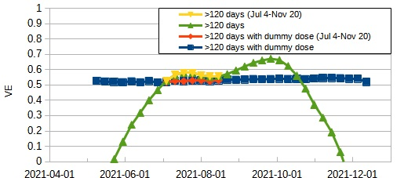

Example: Simple Model with 3rd Dose
===================================

Statens Serum Institut (SSI) in Denmark reported a detailed and informative [study][1] on vaccine effectiveness (VE) .
The study estimated the effectiveness of two and three doses against SARS-CoV-2 infection and COVID-19-related hospitalization in an Alpha, Delta and Omicron dominated period.
This example aims to simulate the three dose vaccination similar to the study with a simplified model.
The model considers three doses and, the Delta and Omicron variants.
But to avoid complexity, only the effectiveness of two doses against the Delta variant is estimated.
The model uses the infection rate derived from weekly infections in Denmark and the vaccination coverage similar to that of age group 60 years or above in Denmark.


Model
-----

An overview of the model is as follows.<a id="Model"></a>

- No dose or three dose vaccination.
- The first dose:
  - Effectiveness against the Delta variant is 30%:
    - The probability that the first dose for an individual takes effect and the individual get full immunity is 30%.
    - The probability that the first dose for an individual takes no effect is 70%.
  - If the first dose takes effect for an individual, it takes 7-14 days after the first dose for the individual to get full immunity.
- The second dose:
  - Effectiveness against the Delta variant is 30% for individuals without full immunity.
  - If an individual has full immunity, the second dose takes no effect for the individual.
  - If the second dose takes effect for an individual, it takes 3-7 days after the second dose for the individual to get full immunity.
  - Total effectiveness with the first dose and the second dose is 51% (= 1.0 - 0.7 x 0.7).
- The third dose:
  - The third dose is used only to reduce the population of individuals who receive the second dose.
- The infection rate is derived from weekly average of infections in Denmark (*).
- Any individual with full immunity doesn't infect.
- Any individual has fever 2-6 days after infection.
- Any infected individual tests positive with 100% probability.

See [report](./report/model_report.md) of the model for further details.


(*) The infection rate is calculated as follows.

The population in Denmark is about 5810000.
Weekly average of infections per person day is
n / 5810000 / 7, where n is the number of weekly infections.
If no vaccination had been executed, the infection rate would have been higher than this value because vaccine effect reduced the number of infections.
This example refers to Table 2 in the study and assumes the vaccine effectiveness against the Delta variant is 75%. The infection rate in the case of no vaccination is
n / 5810000 / 7 / (1 - 0.75).


Simulation
----------

Overview of simulation is as follows.

Simulation:
- The simulation period is 12 months (from 2/1/2021 to 2/1/2022).
- The sample size (the number of individuals) is 500000.
- The vaccination period (see Fig. 1):
  - The second dose from Mar. to Jun., 2021.
  - The third dose from Oct. to Dec., 2021.
- The ratio of vaccination:
  - No dose: 10%
  - One dose: 0%
  - Two doses: 0%
  - Three doses: 90%

Figure 1. Vaccination coverage


```console
$ python ./examples/simple_model_with_3rd_dose/vaceff_simple_model.py --task sim --config config_denmark_3rd_dose.py --count 500000
```


Analysis
--------

The [study][1] by Statens Serum Institut (SSI) in Denmark showed that the two dose vaccine effectiveness (VE) against the Delta variant in individuals aged 60 years or above waned 
with VE of 74.3% 31-60 days, 77.4% 61-90 days, 69.8% 91-120 days, 49.8% >120 days since vaccination.
This example focuses on VE waned >120 days since vaccination.

VE is calculated by the following method.
- VE of two doses is 1 - incidence rate of fully vaccinated individuals / incidence rate of unvaccinated individuals.
- Incidence rate is incidence per person day in an analysis period.
- Unvaccinated individuals are defined as those who doesn't receive the first dose.
- Fully vaccinated individuals are defined as those for whom 7 days had passed since receiving the second dose and who does not receive booster (the third dose).

```console
$ python ./examples/simple_model_with_3rd_dose/vaceff_simple_data_analyze.py --input simple_model_3d_February_February_eff1_dl_7300_om_9100_eff2_dl_7300_om_9100_eff3_dl_10000_om_6400_vacdist_1009_500000.dat
```


Result 1
--------

Fig. 2, Fig. 3 and Fig. 4 show VE and the start date of analysis period which duration are 2, 3 and 4 months, respectively.
The [study][1] set Jul. 4 to Nov. 20, 2021 as the analysis period.
Green lines and yellow lines in these figures indicate VE and VE which analysis period is within Jul. 4 to Nov. 20, 2021.

Figure 2. Fluctuation of VE (Analysis period is 2 months)


Figure 3. Fluctuation of VE (Analysis period is 3 months)


Figure 4. Fluctuation of VE (Analysis period is 4 months)


| Analysis period | min (Jul 4-Nov 20) | max (Jul 4-Nov 20) | min        | max        |
| :-------------: | :----------------: | :----------------: | :--------: | :--------: |
| 2 months        | 0.42               | 0.57               | -2.90      | 0.61       |
| 3 months        | 0.53               | 0.58               | -2.90      | 0.67       |
| 4 months        | 0.53               | 0.55               | -2.90      | 0.68       |


These figures show the fluctuation of VE.

The [study][1] didn't show details about how to analyze VE within Jul. 4 to Nov. 20, 2021.
Depending on the analysis period, the error of VE could reach 0.08.
If the analysis period was 3 months or 4 months, VE could be overestimated by between 0.02 and 0.07.
If the analysis period exceeded Jul. 4 to Nov. 20, 2021, the analysis could derive the large error of VE.
For a better understanding, the study might need to explain the analysis method and the error of VE.

Factors of the fluctuation are considered to be the change in the infection rate and the change in fully vaccinated and unvaccinated population over time (see Fig. 5, Fig. 6).

- Low VE around Jun.: Fully vaccinated population increases and infection rate increases on Jul.
- Rising VE around Aug.: Fully vaccinated population increases and infection rate decreases on Sep.
- Rising VE around Oct.: Fully vaccinated population decreases and infection rate increases on Nov.
- Low VE around Nov.: Fully vaccinated population decreases and infection rate decreases on Dec.


The incidence rate of fully vaccinated individuals and the incidence rate of unvaccinated individuals are calculated in the same analysis period.
Unvaccinated population changes less than fully vaccinated population does.
Therefore, the primary factor of the fluctuation is considered to be the change in fully vaccinated population over time.

Fully vaccinated population changes by the second dose and the third dose vaccination.
The number of individuals for whom 120 days had passed since receiving the second dose began to increase at Jul., 2021 and began to decrease at Oct., 2021 when the third dose vaccination started.
To improve the accuracy of VE estimation, it is considered effective to adjust unvaccinated population to increase and decrease as fully vaccinated population does by introducing a virtual three dose vaccination.
Next, Result 2 explains the details.

Figure 5. Fully vaccinated population and incidence case of the Delta variant in Denmark.


Figure 6. Unvaccinated population and incidence case of the Delta variant in Denmark.


Result 2
--------

To adjust unvaccinated population, this example introduces a virtual three dose vaccination.
The period of the virtual vaccination corresponds to the period of vaccination shown by Fig. 1.
Fig. 7 shows the virtual vaccination coverage. This example calls virtual dose "dummy dose."

Figure 7. Virtual vaccination coverage.


Figure 8. Virtual vaccinated population.


Fig. 9, Fig. 10 and Fig. 11 show VE, VE with dummy dose and the start date of analysis period which duration are 2, 3 and 4 months, respectively.
Blue lines and red lines in these figures indicate VE and VE which analysis period is within Jul. 4 to Nov. 20, 2021 with dummy dose.

Figure 9. Fluctuation of VE (Analysis period is 2 months)


Figure 10. Fluctuation of VE (Analysis period is 3 months)


Figure 11. Fluctuation of VE (Analysis period is 4 months)


These figures show the estimation of VE with dummy dose is almost constant and nearly equal to 0.51 (correct VE value of the model).

| Analysis period | min (Jul 4-Nov 20) | max (Jul 4-Nov 20) | min        | max        |
| :-------------: | :----------------: | :----------------: | :--------: | :--------: |
| 2 months        | 0.52               | 0.53               | 0.51       | 0.55       |
| 3 months        | 0.52               | 0.53               | 0.52       | 0.55       |
| 4 months        | 0.52               | 0.53               | 0.52       | 0.55       |


[1]: https://www.medrxiv.org/content/10.1101/2022.04.20.22274061v1
