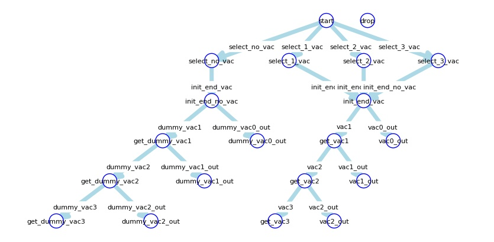
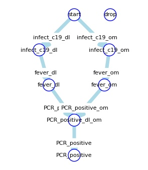
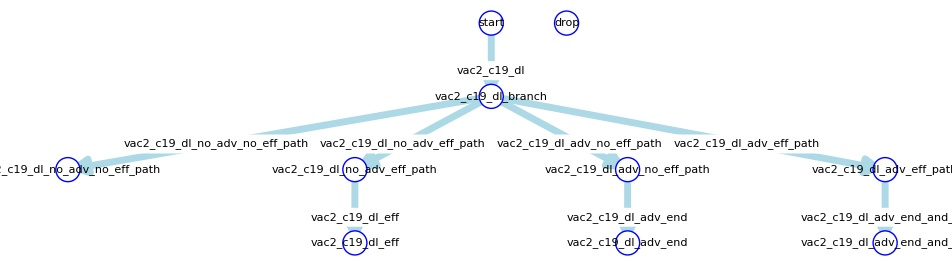

# Model Report

## sm\_vac

| trigger | state (from) | state (to) | event name | event formula |
| --- | --- | --- | --- | --- |
| select\_no\_vac | [start](#sm_vac_start) | [select\_no\_vac](#sm_vac_select_no_vac) | select\_no\_vac | [select\_no\_vac](#select_no_vac) |
| select\_1\_vac | [start](#sm_vac_start) | [select\_1\_vac](#sm_vac_select_1_vac) | select\_1\_vac | [select\_1\_vac](#select_1_vac) |
| select\_2\_vac | [start](#sm_vac_start) | [select\_2\_vac](#sm_vac_select_2_vac) | select\_2\_vac | [select\_2\_vac](#select_2_vac) |
| select\_3\_vac | [start](#sm_vac_start) | [select\_3\_vac](#sm_vac_select_3_vac) | select\_3\_vac | [select\_3\_vac](#select_3_vac) |
| init\_end\_vac | [select\_no\_vac](#sm_vac_select_no_vac) | [init\_end\_no\_vac](#sm_vac_init_end_no_vac) | ev\_init\_end | [ev\_init\_end](#ev_init_end) |
| init\_end\_no\_vac | [select\_1\_vac](#sm_vac_select_1_vac) | [init\_end\_vac](#sm_vac_init_end_vac) | ev\_init\_end | [ev\_init\_end](#ev_init_end) |
| init\_end\_no\_vac | [select\_2\_vac](#sm_vac_select_2_vac) | [init\_end\_vac](#sm_vac_init_end_vac) | ev\_init\_end | [ev\_init\_end](#ev_init_end) |
| init\_end\_no\_vac | [select\_3\_vac](#sm_vac_select_3_vac) | [init\_end\_vac](#sm_vac_init_end_vac) | ev\_init\_end | [ev\_init\_end](#ev_init_end) |
| dummy\_vac1 | [init\_end\_no\_vac](#sm_vac_init_end_no_vac) | [get\_dummy\_vac1](#sm_vac_get_dummy_vac1) | dummy\_vac1 | [dummy\_vac1](#dummy_vac1) |
| dummy\_vac0\_out | [init\_end\_no\_vac](#sm_vac_init_end_no_vac) | [dummy\_vac0\_out](#sm_vac_dummy_vac0_out) | (infect\_c19\_dl|infect\_c19\_om) | ([infect\_c19\_dl](#infect_c19_dl)|[infect\_c19\_om](#infect_c19_om)) |
| vac1 | [init\_end\_vac](#sm_vac_init_end_vac) | [get\_vac1](#sm_vac_get_vac1) | vac1 | [vac1](#vac1) |
| vac0\_out | [init\_end\_vac](#sm_vac_init_end_vac) | [vac0\_out](#sm_vac_vac0_out) | ((infect\_c19\_dl|infect\_c19\_om)|vac0\_out) | (([infect\_c19\_dl](#infect_c19_dl)|[infect\_c19\_om](#infect_c19_om))|[vac0\_out](#vac0_out)) |
| vac2 | [get\_vac1](#sm_vac_get_vac1) | [get\_vac2](#sm_vac_get_vac2) | vac2 | [vac2](#vac2) |
| vac1\_out | [get\_vac1](#sm_vac_get_vac1) | [vac1\_out](#sm_vac_vac1_out) | ((infect\_c19\_dl|infect\_c19\_om)|vac1\_out) | (([infect\_c19\_dl](#infect_c19_dl)|[infect\_c19\_om](#infect_c19_om))|[vac1\_out](#vac1_out)) |
| vac3 | [get\_vac2](#sm_vac_get_vac2) | [get\_vac3](#sm_vac_get_vac3) | vac3 | [vac3](#vac3) |
| vac2\_out | [get\_vac2](#sm_vac_get_vac2) | [vac2\_out](#sm_vac_vac2_out) | ((infect\_c19\_dl|infect\_c19\_om)|vac2\_out) | (([infect\_c19\_dl](#infect_c19_dl)|[infect\_c19\_om](#infect_c19_om))|[vac2\_out](#vac2_out)) |
| dummy\_vac2 | [get\_dummy\_vac1](#sm_vac_get_dummy_vac1) | [get\_dummy\_vac2](#sm_vac_get_dummy_vac2) | dummy\_vac2 | [dummy\_vac2](#dummy_vac2) |
| dummy\_vac1\_out | [get\_dummy\_vac1](#sm_vac_get_dummy_vac1) | [dummy\_vac1\_out](#sm_vac_dummy_vac1_out) | (infect\_c19\_dl|infect\_c19\_om) | ([infect\_c19\_dl](#infect_c19_dl)|[infect\_c19\_om](#infect_c19_om)) |
| dummy\_vac3 | [get\_dummy\_vac2](#sm_vac_get_dummy_vac2) | [get\_dummy\_vac3](#sm_vac_get_dummy_vac3) | dummy\_vac3 | [dummy\_vac3](#dummy_vac3) |
| dummy\_vac2\_out | [get\_dummy\_vac2](#sm_vac_get_dummy_vac2) | [dummy\_vac2\_out](#sm_vac_dummy_vac2_out) | (infect\_c19\_dl|infect\_c19\_om) | ([infect\_c19\_dl](#infect_c19_dl)|[infect\_c19\_om](#infect_c19_om)) |

## sm\_infect

| trigger | state (from) | state (to) | event name | event formula |
| --- | --- | --- | --- | --- |
| infect\_c19\_dl | [start](#sm_infect_start) | [infect\_c19\_dl](#sm_infect_infect_c19_dl) | infect\_c19\_dl | [infect\_c19\_dl](#infect_c19_dl) |
| infect\_c19\_om | [start](#sm_infect_start) | [infect\_c19\_om](#sm_infect_infect_c19_om) | infect\_c19\_om | [infect\_c19\_om](#infect_c19_om) |
| fever\_dl | [infect\_c19\_dl](#sm_infect_infect_c19_dl) | [fever\_dl](#sm_infect_fever_dl) | fever\_dl | [fever\_dl](#fever_dl) |
| fever\_om | [infect\_c19\_om](#sm_infect_infect_c19_om) | [fever\_om](#sm_infect_fever_om) | fever\_om | [fever\_om](#fever_om) |
| PCR\_positive\_dl | [fever\_dl](#sm_infect_fever_dl) | [PCR\_positive\_dl\_om](#sm_infect_PCR_positive_dl_om) | PCR\_positive\_dl | [PCR\_positive\_dl](#PCR_positive_dl) |
| PCR\_positive\_om | [fever\_om](#sm_infect_fever_om) | [PCR\_positive\_dl\_om](#sm_infect_PCR_positive_dl_om) | PCR\_positive\_om | [PCR\_positive\_om](#PCR_positive_om) |
| PCR\_positive | [PCR\_positive\_dl\_om](#sm_infect_PCR_positive_dl_om) | [PCR\_positive](#sm_infect_PCR_positive) | PCR\_positive | [PCR\_positive](#PCR_positive) |

## sm\_vac1\_c19\_dl\_eff

| trigger | state (from) | state (to) | event name | event formula |
| --- | --- | --- | --- | --- |
| vac1\_c19\_dl | [start](#sm_vac1_c19_dl_eff_start) | [vac1\_c19\_dl\_branch](#sm_vac1_c19_dl_eff_vac1_c19_dl_branch) | get\_vac1 | [get\_vac1](#get_vac1) |
| vac1\_c19\_dl\_no\_adv\_no\_eff\_path | [vac1\_c19\_dl\_branch](#sm_vac1_c19_dl_eff_vac1_c19_dl_branch) | [vac1\_c19\_dl\_no\_adv\_no\_eff\_path](#sm_vac1_c19_dl_eff_vac1_c19_dl_no_adv_no_eff_path) | vac1\_c19\_dl\_no\_adv\_no\_eff\_path | [vac1\_c19\_dl\_no\_adv\_no\_eff\_path](#vac1_c19_dl_no_adv_no_eff_path) |
| vac1\_c19\_dl\_no\_adv\_eff\_path | [vac1\_c19\_dl\_branch](#sm_vac1_c19_dl_eff_vac1_c19_dl_branch) | [vac1\_c19\_dl\_no\_adv\_eff\_path](#sm_vac1_c19_dl_eff_vac1_c19_dl_no_adv_eff_path) | vac1\_c19\_dl\_no\_adv\_eff\_path | [vac1\_c19\_dl\_no\_adv\_eff\_path](#vac1_c19_dl_no_adv_eff_path) |
| vac1\_c19\_dl\_adv\_no\_eff\_path | [vac1\_c19\_dl\_branch](#sm_vac1_c19_dl_eff_vac1_c19_dl_branch) | [vac1\_c19\_dl\_adv\_no\_eff\_path](#sm_vac1_c19_dl_eff_vac1_c19_dl_adv_no_eff_path) | vac1\_c19\_dl\_adv\_no\_eff\_path | [vac1\_c19\_dl\_adv\_no\_eff\_path](#vac1_c19_dl_adv_no_eff_path) |
| vac1\_c19\_dl\_adv\_eff\_path | [vac1\_c19\_dl\_branch](#sm_vac1_c19_dl_eff_vac1_c19_dl_branch) | [vac1\_c19\_dl\_adv\_eff\_path](#sm_vac1_c19_dl_eff_vac1_c19_dl_adv_eff_path) | vac1\_c19\_dl\_adv\_eff\_path | [vac1\_c19\_dl\_adv\_eff\_path](#vac1_c19_dl_adv_eff_path) |
| vac1\_c19\_dl\_eff | [vac1\_c19\_dl\_no\_adv\_eff\_path](#sm_vac1_c19_dl_eff_vac1_c19_dl_no_adv_eff_path) | [vac1\_c19\_dl\_eff](#sm_vac1_c19_dl_eff_vac1_c19_dl_eff) | vac1\_c19\_dl\_eff | [vac1\_c19\_dl\_eff](#vac1_c19_dl_eff) |
| vac1\_c19\_dl\_adv\_end | [vac1\_c19\_dl\_adv\_no\_eff\_path](#sm_vac1_c19_dl_eff_vac1_c19_dl_adv_no_eff_path) | [vac1\_c19\_dl\_adv\_end](#sm_vac1_c19_dl_eff_vac1_c19_dl_adv_end) | vac1\_c19\_dl\_adv\_end | [vac1\_c19\_dl\_adv\_end](#vac1_c19_dl_adv_end) |
| vac1\_c19\_dl\_adv\_end\_and\_eff | [vac1\_c19\_dl\_adv\_eff\_path](#sm_vac1_c19_dl_eff_vac1_c19_dl_adv_eff_path) | [vac1\_c19\_dl\_adv\_end\_and\_eff](#sm_vac1_c19_dl_eff_vac1_c19_dl_adv_end_and_eff) | vac1\_c19\_dl\_adv\_end\_and\_eff | [vac1\_c19\_dl\_adv\_end\_and\_eff](#vac1_c19_dl_adv_end_and_eff) |

## sm\_vac1\_c19\_om\_eff

| trigger | state (from) | state (to) | event name | event formula |
| --- | --- | --- | --- | --- |
| vac1\_c19\_om | [start](#sm_vac1_c19_om_eff_start) | [vac1\_c19\_om\_branch](#sm_vac1_c19_om_eff_vac1_c19_om_branch) | get\_vac1 | [get\_vac1](#get_vac1) |
| vac1\_c19\_om\_no\_adv\_no\_eff\_path | [vac1\_c19\_om\_branch](#sm_vac1_c19_om_eff_vac1_c19_om_branch) | [vac1\_c19\_om\_no\_adv\_no\_eff\_path](#sm_vac1_c19_om_eff_vac1_c19_om_no_adv_no_eff_path) | vac1\_c19\_om\_no\_adv\_no\_eff\_path | [vac1\_c19\_om\_no\_adv\_no\_eff\_path](#vac1_c19_om_no_adv_no_eff_path) |
| vac1\_c19\_om\_no\_adv\_eff\_path | [vac1\_c19\_om\_branch](#sm_vac1_c19_om_eff_vac1_c19_om_branch) | [vac1\_c19\_om\_no\_adv\_eff\_path](#sm_vac1_c19_om_eff_vac1_c19_om_no_adv_eff_path) | vac1\_c19\_om\_no\_adv\_eff\_path | [vac1\_c19\_om\_no\_adv\_eff\_path](#vac1_c19_om_no_adv_eff_path) |
| vac1\_c19\_om\_adv\_no\_eff\_path | [vac1\_c19\_om\_branch](#sm_vac1_c19_om_eff_vac1_c19_om_branch) | [vac1\_c19\_om\_adv\_no\_eff\_path](#sm_vac1_c19_om_eff_vac1_c19_om_adv_no_eff_path) | vac1\_c19\_om\_adv\_no\_eff\_path | [vac1\_c19\_om\_adv\_no\_eff\_path](#vac1_c19_om_adv_no_eff_path) |
| vac1\_c19\_om\_adv\_eff\_path | [vac1\_c19\_om\_branch](#sm_vac1_c19_om_eff_vac1_c19_om_branch) | [vac1\_c19\_om\_adv\_eff\_path](#sm_vac1_c19_om_eff_vac1_c19_om_adv_eff_path) | vac1\_c19\_om\_adv\_eff\_path | [vac1\_c19\_om\_adv\_eff\_path](#vac1_c19_om_adv_eff_path) |
| vac1\_c19\_om\_eff | [vac1\_c19\_om\_no\_adv\_eff\_path](#sm_vac1_c19_om_eff_vac1_c19_om_no_adv_eff_path) | [vac1\_c19\_om\_eff](#sm_vac1_c19_om_eff_vac1_c19_om_eff) | vac1\_c19\_om\_eff | [vac1\_c19\_om\_eff](#vac1_c19_om_eff) |
| vac1\_c19\_om\_adv\_end | [vac1\_c19\_om\_adv\_no\_eff\_path](#sm_vac1_c19_om_eff_vac1_c19_om_adv_no_eff_path) | [vac1\_c19\_om\_adv\_end](#sm_vac1_c19_om_eff_vac1_c19_om_adv_end) | vac1\_c19\_om\_adv\_end | [vac1\_c19\_om\_adv\_end](#vac1_c19_om_adv_end) |
| vac1\_c19\_om\_adv\_end\_and\_eff | [vac1\_c19\_om\_adv\_eff\_path](#sm_vac1_c19_om_eff_vac1_c19_om_adv_eff_path) | [vac1\_c19\_om\_adv\_end\_and\_eff](#sm_vac1_c19_om_eff_vac1_c19_om_adv_end_and_eff) | vac1\_c19\_om\_adv\_end\_and\_eff | [vac1\_c19\_om\_adv\_end\_and\_eff](#vac1_c19_om_adv_end_and_eff) |

## sm\_vac2\_c19\_dl\_eff

| trigger | state (from) | state (to) | event name | event formula |
| --- | --- | --- | --- | --- |
| vac2\_c19\_dl | [start](#sm_vac2_c19_dl_eff_start) | [vac2\_c19\_dl\_branch](#sm_vac2_c19_dl_eff_vac2_c19_dl_branch) | get\_vac2 | [get\_vac2](#get_vac2) |
| vac2\_c19\_dl\_no\_adv\_no\_eff\_path | [vac2\_c19\_dl\_branch](#sm_vac2_c19_dl_eff_vac2_c19_dl_branch) | [vac2\_c19\_dl\_no\_adv\_no\_eff\_path](#sm_vac2_c19_dl_eff_vac2_c19_dl_no_adv_no_eff_path) | vac2\_c19\_dl\_no\_adv\_no\_eff\_path | [vac2\_c19\_dl\_no\_adv\_no\_eff\_path](#vac2_c19_dl_no_adv_no_eff_path) |
| vac2\_c19\_dl\_no\_adv\_eff\_path | [vac2\_c19\_dl\_branch](#sm_vac2_c19_dl_eff_vac2_c19_dl_branch) | [vac2\_c19\_dl\_no\_adv\_eff\_path](#sm_vac2_c19_dl_eff_vac2_c19_dl_no_adv_eff_path) | vac2\_c19\_dl\_no\_adv\_eff\_path | [vac2\_c19\_dl\_no\_adv\_eff\_path](#vac2_c19_dl_no_adv_eff_path) |
| vac2\_c19\_dl\_adv\_no\_eff\_path | [vac2\_c19\_dl\_branch](#sm_vac2_c19_dl_eff_vac2_c19_dl_branch) | [vac2\_c19\_dl\_adv\_no\_eff\_path](#sm_vac2_c19_dl_eff_vac2_c19_dl_adv_no_eff_path) | vac2\_c19\_dl\_adv\_no\_eff\_path | [vac2\_c19\_dl\_adv\_no\_eff\_path](#vac2_c19_dl_adv_no_eff_path) |
| vac2\_c19\_dl\_adv\_eff\_path | [vac2\_c19\_dl\_branch](#sm_vac2_c19_dl_eff_vac2_c19_dl_branch) | [vac2\_c19\_dl\_adv\_eff\_path](#sm_vac2_c19_dl_eff_vac2_c19_dl_adv_eff_path) | vac2\_c19\_dl\_adv\_eff\_path | [vac2\_c19\_dl\_adv\_eff\_path](#vac2_c19_dl_adv_eff_path) |
| vac2\_c19\_dl\_eff | [vac2\_c19\_dl\_no\_adv\_eff\_path](#sm_vac2_c19_dl_eff_vac2_c19_dl_no_adv_eff_path) | [vac2\_c19\_dl\_eff](#sm_vac2_c19_dl_eff_vac2_c19_dl_eff) | vac2\_c19\_dl\_eff | [vac2\_c19\_dl\_eff](#vac2_c19_dl_eff) |
| vac2\_c19\_dl\_adv\_end | [vac2\_c19\_dl\_adv\_no\_eff\_path](#sm_vac2_c19_dl_eff_vac2_c19_dl_adv_no_eff_path) | [vac2\_c19\_dl\_adv\_end](#sm_vac2_c19_dl_eff_vac2_c19_dl_adv_end) | vac2\_c19\_dl\_adv\_end | [vac2\_c19\_dl\_adv\_end](#vac2_c19_dl_adv_end) |
| vac2\_c19\_dl\_adv\_end\_and\_eff | [vac2\_c19\_dl\_adv\_eff\_path](#sm_vac2_c19_dl_eff_vac2_c19_dl_adv_eff_path) | [vac2\_c19\_dl\_adv\_end\_and\_eff](#sm_vac2_c19_dl_eff_vac2_c19_dl_adv_end_and_eff) | vac2\_c19\_dl\_adv\_end\_and\_eff | [vac2\_c19\_dl\_adv\_end\_and\_eff](#vac2_c19_dl_adv_end_and_eff) |

## sm\_vac2\_c19\_om\_eff

| trigger | state (from) | state (to) | event name | event formula |
| --- | --- | --- | --- | --- |
| vac2\_c19\_om | [start](#sm_vac2_c19_om_eff_start) | [vac2\_c19\_om\_branch](#sm_vac2_c19_om_eff_vac2_c19_om_branch) | get\_vac2 | [get\_vac2](#get_vac2) |
| vac2\_c19\_om\_no\_adv\_no\_eff\_path | [vac2\_c19\_om\_branch](#sm_vac2_c19_om_eff_vac2_c19_om_branch) | [vac2\_c19\_om\_no\_adv\_no\_eff\_path](#sm_vac2_c19_om_eff_vac2_c19_om_no_adv_no_eff_path) | vac2\_c19\_om\_no\_adv\_no\_eff\_path | [vac2\_c19\_om\_no\_adv\_no\_eff\_path](#vac2_c19_om_no_adv_no_eff_path) |
| vac2\_c19\_om\_no\_adv\_eff\_path | [vac2\_c19\_om\_branch](#sm_vac2_c19_om_eff_vac2_c19_om_branch) | [vac2\_c19\_om\_no\_adv\_eff\_path](#sm_vac2_c19_om_eff_vac2_c19_om_no_adv_eff_path) | vac2\_c19\_om\_no\_adv\_eff\_path | [vac2\_c19\_om\_no\_adv\_eff\_path](#vac2_c19_om_no_adv_eff_path) |
| vac2\_c19\_om\_adv\_no\_eff\_path | [vac2\_c19\_om\_branch](#sm_vac2_c19_om_eff_vac2_c19_om_branch) | [vac2\_c19\_om\_adv\_no\_eff\_path](#sm_vac2_c19_om_eff_vac2_c19_om_adv_no_eff_path) | vac2\_c19\_om\_adv\_no\_eff\_path | [vac2\_c19\_om\_adv\_no\_eff\_path](#vac2_c19_om_adv_no_eff_path) |
| vac2\_c19\_om\_adv\_eff\_path | [vac2\_c19\_om\_branch](#sm_vac2_c19_om_eff_vac2_c19_om_branch) | [vac2\_c19\_om\_adv\_eff\_path](#sm_vac2_c19_om_eff_vac2_c19_om_adv_eff_path) | vac2\_c19\_om\_adv\_eff\_path | [vac2\_c19\_om\_adv\_eff\_path](#vac2_c19_om_adv_eff_path) |
| vac2\_c19\_om\_eff | [vac2\_c19\_om\_no\_adv\_eff\_path](#sm_vac2_c19_om_eff_vac2_c19_om_no_adv_eff_path) | [vac2\_c19\_om\_eff](#sm_vac2_c19_om_eff_vac2_c19_om_eff) | vac2\_c19\_om\_eff | [vac2\_c19\_om\_eff](#vac2_c19_om_eff) |
| vac2\_c19\_om\_adv\_end | [vac2\_c19\_om\_adv\_no\_eff\_path](#sm_vac2_c19_om_eff_vac2_c19_om_adv_no_eff_path) | [vac2\_c19\_om\_adv\_end](#sm_vac2_c19_om_eff_vac2_c19_om_adv_end) | vac2\_c19\_om\_adv\_end | [vac2\_c19\_om\_adv\_end](#vac2_c19_om_adv_end) |
| vac2\_c19\_om\_adv\_end\_and\_eff | [vac2\_c19\_om\_adv\_eff\_path](#sm_vac2_c19_om_eff_vac2_c19_om_adv_eff_path) | [vac2\_c19\_om\_adv\_end\_and\_eff](#sm_vac2_c19_om_eff_vac2_c19_om_adv_end_and_eff) | vac2\_c19\_om\_adv\_end\_and\_eff | [vac2\_c19\_om\_adv\_end\_and\_eff](#vac2_c19_om_adv_end_and_eff) |

## sm\_vac3\_c19\_dl\_eff

| trigger | state (from) | state (to) | event name | event formula |
| --- | --- | --- | --- | --- |
| vac3\_c19\_dl | [start](#sm_vac3_c19_dl_eff_start) | [vac3\_c19\_dl\_branch](#sm_vac3_c19_dl_eff_vac3_c19_dl_branch) | get\_vac3 | [get\_vac3](#get_vac3) |
| vac3\_c19\_dl\_no\_adv\_no\_eff\_path | [vac3\_c19\_dl\_branch](#sm_vac3_c19_dl_eff_vac3_c19_dl_branch) | [vac3\_c19\_dl\_no\_adv\_no\_eff\_path](#sm_vac3_c19_dl_eff_vac3_c19_dl_no_adv_no_eff_path) | vac3\_c19\_dl\_no\_adv\_no\_eff\_path | [vac3\_c19\_dl\_no\_adv\_no\_eff\_path](#vac3_c19_dl_no_adv_no_eff_path) |
| vac3\_c19\_dl\_no\_adv\_eff\_path | [vac3\_c19\_dl\_branch](#sm_vac3_c19_dl_eff_vac3_c19_dl_branch) | [vac3\_c19\_dl\_no\_adv\_eff\_path](#sm_vac3_c19_dl_eff_vac3_c19_dl_no_adv_eff_path) | vac3\_c19\_dl\_no\_adv\_eff\_path | [vac3\_c19\_dl\_no\_adv\_eff\_path](#vac3_c19_dl_no_adv_eff_path) |
| vac3\_c19\_dl\_adv\_no\_eff\_path | [vac3\_c19\_dl\_branch](#sm_vac3_c19_dl_eff_vac3_c19_dl_branch) | [vac3\_c19\_dl\_adv\_no\_eff\_path](#sm_vac3_c19_dl_eff_vac3_c19_dl_adv_no_eff_path) | vac3\_c19\_dl\_adv\_no\_eff\_path | [vac3\_c19\_dl\_adv\_no\_eff\_path](#vac3_c19_dl_adv_no_eff_path) |
| vac3\_c19\_dl\_adv\_eff\_path | [vac3\_c19\_dl\_branch](#sm_vac3_c19_dl_eff_vac3_c19_dl_branch) | [vac3\_c19\_dl\_adv\_eff\_path](#sm_vac3_c19_dl_eff_vac3_c19_dl_adv_eff_path) | vac3\_c19\_dl\_adv\_eff\_path | [vac3\_c19\_dl\_adv\_eff\_path](#vac3_c19_dl_adv_eff_path) |
| vac3\_c19\_dl\_eff | [vac3\_c19\_dl\_no\_adv\_eff\_path](#sm_vac3_c19_dl_eff_vac3_c19_dl_no_adv_eff_path) | [vac3\_c19\_dl\_eff](#sm_vac3_c19_dl_eff_vac3_c19_dl_eff) | vac3\_c19\_dl\_eff | [vac3\_c19\_dl\_eff](#vac3_c19_dl_eff) |
| vac3\_c19\_dl\_adv\_end | [vac3\_c19\_dl\_adv\_no\_eff\_path](#sm_vac3_c19_dl_eff_vac3_c19_dl_adv_no_eff_path) | [vac3\_c19\_dl\_adv\_end](#sm_vac3_c19_dl_eff_vac3_c19_dl_adv_end) | vac3\_c19\_dl\_adv\_end | [vac3\_c19\_dl\_adv\_end](#vac3_c19_dl_adv_end) |
| vac3\_c19\_dl\_adv\_end\_and\_eff | [vac3\_c19\_dl\_adv\_eff\_path](#sm_vac3_c19_dl_eff_vac3_c19_dl_adv_eff_path) | [vac3\_c19\_dl\_adv\_end\_and\_eff](#sm_vac3_c19_dl_eff_vac3_c19_dl_adv_end_and_eff) | vac3\_c19\_dl\_adv\_end\_and\_eff | [vac3\_c19\_dl\_adv\_end\_and\_eff](#vac3_c19_dl_adv_end_and_eff) |

## sm\_vac3\_c19\_om\_eff

| trigger | state (from) | state (to) | event name | event formula |
| --- | --- | --- | --- | --- |
| vac3\_c19\_om | [start](#sm_vac3_c19_om_eff_start) | [vac3\_c19\_om\_branch](#sm_vac3_c19_om_eff_vac3_c19_om_branch) | get\_vac3 | [get\_vac3](#get_vac3) |
| vac3\_c19\_om\_no\_adv\_no\_eff\_path | [vac3\_c19\_om\_branch](#sm_vac3_c19_om_eff_vac3_c19_om_branch) | [vac3\_c19\_om\_no\_adv\_no\_eff\_path](#sm_vac3_c19_om_eff_vac3_c19_om_no_adv_no_eff_path) | vac3\_c19\_om\_no\_adv\_no\_eff\_path | [vac3\_c19\_om\_no\_adv\_no\_eff\_path](#vac3_c19_om_no_adv_no_eff_path) |
| vac3\_c19\_om\_no\_adv\_eff\_path | [vac3\_c19\_om\_branch](#sm_vac3_c19_om_eff_vac3_c19_om_branch) | [vac3\_c19\_om\_no\_adv\_eff\_path](#sm_vac3_c19_om_eff_vac3_c19_om_no_adv_eff_path) | vac3\_c19\_om\_no\_adv\_eff\_path | [vac3\_c19\_om\_no\_adv\_eff\_path](#vac3_c19_om_no_adv_eff_path) |
| vac3\_c19\_om\_adv\_no\_eff\_path | [vac3\_c19\_om\_branch](#sm_vac3_c19_om_eff_vac3_c19_om_branch) | [vac3\_c19\_om\_adv\_no\_eff\_path](#sm_vac3_c19_om_eff_vac3_c19_om_adv_no_eff_path) | vac3\_c19\_om\_adv\_no\_eff\_path | [vac3\_c19\_om\_adv\_no\_eff\_path](#vac3_c19_om_adv_no_eff_path) |
| vac3\_c19\_om\_adv\_eff\_path | [vac3\_c19\_om\_branch](#sm_vac3_c19_om_eff_vac3_c19_om_branch) | [vac3\_c19\_om\_adv\_eff\_path](#sm_vac3_c19_om_eff_vac3_c19_om_adv_eff_path) | vac3\_c19\_om\_adv\_eff\_path | [vac3\_c19\_om\_adv\_eff\_path](#vac3_c19_om_adv_eff_path) |
| vac3\_c19\_om\_eff | [vac3\_c19\_om\_no\_adv\_eff\_path](#sm_vac3_c19_om_eff_vac3_c19_om_no_adv_eff_path) | [vac3\_c19\_om\_eff](#sm_vac3_c19_om_eff_vac3_c19_om_eff) | vac3\_c19\_om\_eff | [vac3\_c19\_om\_eff](#vac3_c19_om_eff) |
| vac3\_c19\_om\_adv\_end | [vac3\_c19\_om\_adv\_no\_eff\_path](#sm_vac3_c19_om_eff_vac3_c19_om_adv_no_eff_path) | [vac3\_c19\_om\_adv\_end](#sm_vac3_c19_om_eff_vac3_c19_om_adv_end) | vac3\_c19\_om\_adv\_end | [vac3\_c19\_om\_adv\_end](#vac3_c19_om_adv_end) |
| vac3\_c19\_om\_adv\_end\_and\_eff | [vac3\_c19\_om\_adv\_eff\_path](#sm_vac3_c19_om_eff_vac3_c19_om_adv_eff_path) | [vac3\_c19\_om\_adv\_end\_and\_eff](#sm_vac3_c19_om_eff_vac3_c19_om_adv_end_and_eff) | vac3\_c19\_om\_adv\_end\_and\_eff | [vac3\_c19\_om\_adv\_end\_and\_eff](#vac3_c19_om_adv_end_and_eff) |

## Event

| event name | event type | event info (some information omitted in md file) |
| --- | --- | --- |
| vac1\_c19\_dl\_adv\_end\_and\_eff | TimerEvent |  |
| fever\_dl | TimerEvent |  |
| fever\_om | TimerEvent |  |
| PCR\_positive\_dl | DummyEvent |  |
| PCR\_positive\_om | DummyEvent |  |
| vac3\_c19\_om\_no\_adv\_no\_eff\_path | RandomEventChild |  |
| PCR\_positive | DummyEvent |  |
| get\_vac3 | StateEvent |  |
| vac3\_c19\_om\_no\_adv\_eff\_path | RandomEventChild |  |
| vac3\_c19\_om\_adv\_eff\_path | RandomEventChild |  |
| vac2\_c19\_dl\_no\_adv\_no\_eff\_path | RandomEventChild |  |
| select\_no\_vac | RandomEventChild |  |
| vac2\_c19\_dl\_no\_adv\_eff\_path | RandomEventChild |  |
| select\_1\_vac | RandomEventChild |  |
| vac2\_c19\_dl\_adv\_no\_eff\_path | RandomEventChild |  |
| vac2\_c19\_om\_no\_adv\_no\_eff\_path | RandomEventChild |  |
| select\_2\_vac | RandomEventChild |  |
| vac2\_c19\_dl\_adv\_eff\_path | RandomEventChild |  |
| vac2\_c19\_om\_no\_adv\_eff\_path | RandomEventChild |  |
| vac3\_c19\_om\_adv\_no\_eff\_path | RandomEventChild |  |
| select\_3\_vac | RandomEventChild |  |
| vac3\_c19\_dl\_no\_adv\_no\_eff\_path | RandomEventChild |  |
| vac2\_c19\_om\_adv\_no\_eff\_path | RandomEventChild |  |
| ev\_init\_end | DummyEvent |  |
| vac2\_c19\_dl\_eff | TimerEvent |  |
| vac2\_c19\_om\_adv\_eff\_path | RandomEventChild |  |
| vac3\_c19\_dl\_no\_adv\_eff\_path | RandomEventChild |  |
| vac1 | TimerEvent |  |
| vac3\_c19\_dl\_adv\_no\_eff\_path | RandomEventChild |  |
| vac1\_c19\_om\_no\_adv\_no\_eff\_path | RandomEventChild |  |
| vac2 | TimerEvent |  |
| vac2\_c19\_dl\_adv\_end | TimerEvent |  |
| vac1\_c19\_om\_no\_adv\_eff\_path | RandomEventChild |  |
| vac2\_c19\_om\_eff | TimerEvent |  |
| vac3 | TimerEvent |  |
| vac3\_c19\_dl\_adv\_eff\_path | RandomEventChild |  |
| vac1\_c19\_om\_adv\_no\_eff\_path | RandomEventChild |  |
| dummy\_vac1 | TimerEvent |  |
| vac2\_c19\_dl\_adv\_end\_and\_eff | TimerEvent |  |
| vac1\_c19\_om\_adv\_eff\_path | RandomEventChild |  |
| vac2\_c19\_om\_adv\_end | TimerEvent |  |
| dummy\_vac2 | TimerEvent |  |
| vac3\_c19\_dl\_eff | TimerEvent |  |
| vac1\_c19\_om\_eff | TimerEvent |  |
| dummy\_vac3 | TimerEvent |  |
| vac3\_c19\_dl\_adv\_end | TimerEvent |  |
| vac1\_c19\_om\_adv\_end | TimerEvent |  |
| vac2\_c19\_om\_adv\_end\_and\_eff | TimerEvent |  |
| vac0\_out | ParameterEvent |  |
| vac3\_c19\_om\_eff | TimerEvent |  |
| vac1\_c19\_om\_adv\_end\_and\_eff | TimerEvent |  |
| vac1\_out | ParameterEvent |  |
| vac3\_c19\_dl\_adv\_end\_and\_eff | TimerEvent |  |
| vac3\_c19\_om\_adv\_end | TimerEvent |  |
| vac2\_out | ParameterEvent |  |
| get\_vac1 | StateEvent |  |
| vac1\_c19\_dl\_no\_adv\_no\_eff\_path | RandomEventChild |  |
| vac3\_c19\_om\_adv\_end\_and\_eff | TimerEvent |  |
| vac1\_c19\_dl\_no\_adv\_eff\_path | RandomEventChild |  |
| vac1\_c19\_dl\_adv\_no\_eff\_path | RandomEventChild |  |
| get\_vac2 | StateEvent |  |
| vac1\_c19\_dl\_adv\_eff\_path | RandomEventChild |  |
| infect\_c19\_dl | StochasticEvent |  |
| vac1\_c19\_dl\_eff | TimerEvent |  |
| vac1\_c19\_dl\_adv\_end | TimerEvent |  |
| infect\_c19\_om | StochasticEvent |  |

## State

| state machine | state name | state info and update parameter func (some information omitted in md file) |
| --- | --- | --- |
| sm\_vac1\_c19\_om\_eff | start |  |
| sm\_vac1\_c19\_om\_eff | drop |  |
| sm\_vac1\_c19\_om\_eff | vac1\_c19\_om\_branch |  |
| sm\_vac1\_c19\_om\_eff | vac1\_c19\_om\_no\_adv\_no\_eff\_path |  |
| sm\_vac1\_c19\_om\_eff | vac1\_c19\_om\_no\_adv\_eff\_path |  |
| sm\_vac1\_c19\_om\_eff | vac1\_c19\_om\_adv\_no\_eff\_path |  |
| sm\_vac1\_c19\_om\_eff | vac1\_c19\_om\_adv\_eff\_path |  |
| sm\_vac1\_c19\_om\_eff | vac1\_c19\_om\_eff |  |
| sm\_vac | init\_end\_no\_vac |  |
| sm\_vac1\_c19\_om\_eff | vac1\_c19\_om\_adv\_end |  |
| sm\_infect | start |  |
| sm\_infect | drop |  |
| sm\_vac1\_c19\_om\_eff | vac1\_c19\_om\_adv\_end\_and\_eff |  |
| sm\_infect | infect\_c19\_dl |  |
| sm\_infect | infect\_c19\_om |  |
| sm\_infect | fever\_dl |  |
| sm\_vac | init\_end\_vac |  |
| sm\_infect | fever\_om |  |
| sm\_vac | vac0\_out |  |
| sm\_infect | PCR\_positive\_dl\_om |  |
| sm\_vac | get\_vac1 |  |
| sm\_infect | PCR\_positive |  |
| sm\_vac2\_c19\_dl\_eff | start |  |
| sm\_vac2\_c19\_dl\_eff | drop |  |
| sm\_vac | vac1\_out |  |
| sm\_vac | get\_vac2 |  |
| sm\_vac2\_c19\_dl\_eff | vac2\_c19\_dl\_branch |  |
| sm\_vac | get\_vac3 |  |
| sm\_vac2\_c19\_dl\_eff | vac2\_c19\_dl\_no\_adv\_no\_eff\_path |  |
| sm\_vac | vac2\_out |  |
| sm\_vac | get\_dummy\_vac1 |  |
| sm\_vac2\_c19\_dl\_eff | vac2\_c19\_dl\_no\_adv\_eff\_path |  |
| sm\_vac2\_c19\_dl\_eff | vac2\_c19\_dl\_adv\_no\_eff\_path |  |
| sm\_vac | dummy\_vac0\_out |  |
| sm\_vac2\_c19\_dl\_eff | vac2\_c19\_dl\_adv\_eff\_path |  |
| sm\_vac | get\_dummy\_vac2 |  |
| sm\_vac2\_c19\_dl\_eff | vac2\_c19\_dl\_eff |  |
| sm\_vac | dummy\_vac1\_out |  |
| sm\_vac1\_c19\_dl\_eff | start |  |
| sm\_vac2\_c19\_dl\_eff | vac2\_c19\_dl\_adv\_end |  |
| sm\_vac | get\_dummy\_vac3 |  |
| sm\_vac1\_c19\_dl\_eff | drop |  |
| sm\_vac2\_c19\_dl\_eff | vac2\_c19\_dl\_adv\_end\_and\_eff |  |
| sm\_vac | dummy\_vac2\_out |  |
| sm\_vac1\_c19\_dl\_eff | vac1\_c19\_dl\_branch |  |
| sm\_vac1\_c19\_dl\_eff | vac1\_c19\_dl\_no\_adv\_no\_eff\_path |  |
| sm\_vac1\_c19\_dl\_eff | vac1\_c19\_dl\_no\_adv\_eff\_path |  |
| sm\_vac1\_c19\_dl\_eff | vac1\_c19\_dl\_adv\_no\_eff\_path |  |
| sm\_vac1\_c19\_dl\_eff | vac1\_c19\_dl\_adv\_eff\_path |  |
| sm\_vac1\_c19\_dl\_eff | vac1\_c19\_dl\_eff |  |
| sm\_vac1\_c19\_dl\_eff | vac1\_c19\_dl\_adv\_end |  |
| sm\_vac1\_c19\_dl\_eff | vac1\_c19\_dl\_adv\_end\_and\_eff |  |
| sm\_vac2\_c19\_om\_eff | start |  |
| sm\_vac2\_c19\_om\_eff | drop |  |
| sm\_vac2\_c19\_om\_eff | vac2\_c19\_om\_branch |  |
| sm\_vac3\_c19\_om\_eff | start |  |
| sm\_vac2\_c19\_om\_eff | vac2\_c19\_om\_no\_adv\_no\_eff\_path |  |
| sm\_vac3\_c19\_om\_eff | drop |  |
| sm\_vac2\_c19\_om\_eff | vac2\_c19\_om\_no\_adv\_eff\_path |  |
| sm\_vac3\_c19\_om\_eff | vac3\_c19\_om\_branch |  |
| sm\_vac2\_c19\_om\_eff | vac2\_c19\_om\_adv\_no\_eff\_path |  |
| sm\_vac3\_c19\_om\_eff | vac3\_c19\_om\_no\_adv\_no\_eff\_path |  |
| sm\_vac2\_c19\_om\_eff | vac2\_c19\_om\_adv\_eff\_path |  |
| sm\_vac3\_c19\_om\_eff | vac3\_c19\_om\_no\_adv\_eff\_path |  |
| sm\_vac2\_c19\_om\_eff | vac2\_c19\_om\_eff |  |
| sm\_vac3\_c19\_om\_eff | vac3\_c19\_om\_adv\_no\_eff\_path |  |
| sm\_vac | select\_3\_vac |  |
| sm\_vac2\_c19\_om\_eff | vac2\_c19\_om\_adv\_end |  |
| sm\_vac3\_c19\_om\_eff | vac3\_c19\_om\_adv\_eff\_path |  |
| sm\_vac2\_c19\_om\_eff | vac2\_c19\_om\_adv\_end\_and\_eff |  |
| sm\_vac3\_c19\_om\_eff | vac3\_c19\_om\_eff |  |
| sm\_vac3\_c19\_om\_eff | vac3\_c19\_om\_adv\_end |  |
| sm\_vac3\_c19\_om\_eff | vac3\_c19\_om\_adv\_end\_and\_eff |  |
| sm\_vac | select\_2\_vac |  |
| sm\_vac3\_c19\_dl\_eff | start |  |
| sm\_vac3\_c19\_dl\_eff | drop |  |
| sm\_vac3\_c19\_dl\_eff | vac3\_c19\_dl\_branch |  |
| sm\_vac | select\_1\_vac |  |
| sm\_vac3\_c19\_dl\_eff | vac3\_c19\_dl\_no\_adv\_no\_eff\_path |  |
| sm\_vac3\_c19\_dl\_eff | vac3\_c19\_dl\_no\_adv\_eff\_path |  |
| sm\_vac | start |  |
| sm\_vac3\_c19\_dl\_eff | vac3\_c19\_dl\_adv\_no\_eff\_path |  |
| sm\_vac3\_c19\_dl\_eff | vac3\_c19\_dl\_adv\_eff\_path |  |
| sm\_vac | select\_no\_vac |  |
| sm\_vac3\_c19\_dl\_eff | vac3\_c19\_dl\_eff |  |
| sm\_vac3\_c19\_dl\_eff | vac3\_c19\_dl\_adv\_end |  |
| sm\_vac | drop |  |
| sm\_vac3\_c19\_dl\_eff | vac3\_c19\_dl\_adv\_end\_and\_eff |  |

