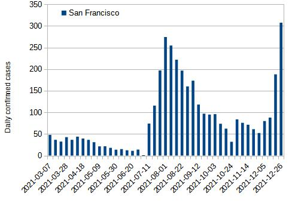

Example: Simple Model with Varying Infection Rate
=================================================

This example shows a model of two doses vaccination and simulation results.
A simplified model is used for understanding essential natures by excluding factors which complicate vaccine efficacy analyses.
This model uses the infection rate derived from weekly infections in San Francisco.

Model
-----

An overview of the model is as follows.<a id="Model"></a>

- No dose or two doses vaccination.
- The first dose:
  - Efficacy is 30%:
    - The probability that the first dose for an individual takes effect and the individual get full immunity is 30%.
    - The probability that the first dose for an individual takes no effect is 70%.
  - If the first dose takes effect for an individual, it takes 7-14 days after the first dose for the individual to get full immunity.
- The second dose:
  - Efficacy is 30% for individuals without full immunity.
  - If an individual has full immunity, the second dose takes no effect for the individual.
  - If the second dose takes effect for an individual, it takes 3-7 days after the second dose for the individual to get full immunity.
  - Total efficacy with the first dose and the second dose is 51% (= 1.0 - 0.7 x 0.7).
- The infection rate is derived from weekly average of infections in San Francisco (*).
- Any individual with full immunity doesn't infect.
- Any individual has fever 2-6 days after infection.
- Any infected individual tests positive with 100% probability.

See [report](./report/model_report.md) of the model for further details.


(*) The infection rate is calculated as follows.

The population in San Francisco is about 900000.
Weekly average of infections per person day is
n / 900000 / 7, where n is the number of weekly infections.
If no vaccination had been executed, the infection rate would have been higher than this value because vaccine effect reduced the number of infections.
To assume vaccine efficacy is 85%, the infection rate in the case of no vaccination is
n / 900000 / 7 / (1 - 0.85).

Simulation
----------

Overviews of simulations are as follows.

Simulation 1:
- The simulation period is 4 months (from 7/1/2021 to 11/1/2021).
- The sample size (the number of people) is 30000.
- The vaccination period is 2 months (from 7/1/2021 to 9/1/2021).
  - The vaccination of the first dose ends before 8/1/2021.
  - The vaccination of the second dose ends before 9/1/2021.
- The ratio of vaccination:
  - No dose: 10%
  - One dose: 0%
  - Two doses: 90% (equivalent to the ratio in Israel)

Simulation 2:
- The simulation period is 4 months (from 8/1/2021 to 12/1/2021).
- The sample size is same as Simulation 1.
- The vaccination period is 2 months (from 8/1/2021 to 10/1/2021).
  - The vaccination of the first dose ends before 9/1/2021.
  - The vaccination of the second dose ends before 10/1/2021.
- The ratio of vaccination is same as Simulation 1.


In Simulation 1 and Simulation 2, the vaccinations are executed during an epidemic.
The condition of the vaccinations is same as that of the vaccination of COVID-19.
In contrast to this condition, what happens if the vaccination completes before an epidemic.
To confirm it, Simulation 3 and Simulation 4 are used.


Simulation 3: vaccination completed before an epidemic
- The simulation period is 6 months (from 5/1/2021 to 11/1/2021).
- The vaccination period is 2 months (from 5/1/2021 to 7/1/2021).
  - The vaccination of the first dose ends before 6/1/2021.
  - The vaccination of the second dose ends before 7/1/2021.
- The epidemic starts on 7/1/2021.
- The sample size is same as Simulation 1.
- The ratio of vaccination is same as Simulation 1.

Simulation 4: vaccination completed before an epidemic
- The simulation period is 6 months (from 6/1/2021 to 12/1/2021).
- The vaccination period is 2 months (from 6/1/2021 to 8/1/2021).
  - The vaccination of the first dose ends before 7/1/2021.
  - The vaccination of the second dose ends before 8/1/2021.
- The epidemic starts on 8/1/2021.
- The sample size is same as Simulation 1.
- The ratio of vaccination is same as Simulation 1.

```console
$ python ./examples/simple_model_with_varying_infection_rate/vaceff_simple_model.py --task sim --config config_july_2021_no_adv.py --count 30000
$ python ./examples/simple_model_with_varying_infection_rate/vaceff_simple_model.py --task sim --config config_august_2021_no_adv.py --count 30000
$ python ./examples/simple_model_with_varying_infection_rate/vaceff_simple_model.py --task sim --config config_may_2021_no_adv.py --count 30000
$ python ./examples/simple_model_with_varying_infection_rate/vaceff_simple_model.py --task sim --config config_june_2021_no_adv.py --count 30000
```

Analysis
--------

Vaccine efficacy is calculated for each analysis method.
Analysis 1 is the analysis described in [README](../simple_model/README.md).

Analysis 1:
- Vaccine efficacy (VE) is 1 - incidence rate of fully vaccinated people / incidence rate of unvaccinated people.
- Incidence rate is incidence per person day.
- Unvaccinated individuals are defined as those who doesn't receive the first dose of vaccine.
- Fully vaccinated individuals are defined as those for whom 7 days had passed since receiving the second dose of vaccine.

Analysis 2:
- Vaccine efficacy (VE) is 1 - incidence rate of fully vaccinated people / incidence rate of unvaccinated people.
- Incidence rate is calculated by averaging daily incidence per person day.
- The averaging time periods for incidence rate of fully vaccinated people and incidence rate of unvaccinated people are the same.
- Definitions of unvaccinated individuals and fully vaccinated individuals are same as those of Analysis 1.

```console
$ python ./examples/simple_model_with_varying_infection_rate/vaceff_simple_data_analyze_vac_during_pandemic.py --input simple_model_vir_July_November_eff1_7_3_0_0_eff2_7_3_0_0_vacdist_1_0_9_30000.dat
$ python ./examples/simple_model_with_varying_infection_rate/vaceff_simple_data_analyze_vac_during_pandemic.py --input simple_model_vir_August_December_eff1_7_3_0_0_eff2_7_3_0_0_vacdist_1_0_9_30000.dat
$ python ./examples/simple_model_with_varying_infection_rate/vaceff_simple_data_analyze_vac_before_pandemic.py --input simple_model_vir_May_November_eff1_7_3_0_0_eff2_7_3_0_0_vacdist_1_0_9_30000.dat --startdate 2021-07-01
$ python ./examples/simple_model_with_varying_infection_rate/vaceff_simple_data_analyze_vac_before_pandemic.py --input simple_model_vir_June_December_eff1_7_3_0_0_eff2_7_3_0_0_vacdist_1_0_9_30000.dat --startdate 2021-08-01
```

Result
------

The vaccine efficacy of the model is set to 51% (see [Model](#Model)).
Analysis 1 shows that the error is about 30 percentage points.

|              | Analysis 1 | Analysis 2 |
| :----------: | :--------: | :--------: |
| Simulation 1 | 0.29       | 0.53       |
| Simulation 2 | 0.82       | 0.56       |
| Simulation 3 | 0.56       | 0.56       |
| Simulation 4 | 0.53       | 0.53       |

What is the cause of this error?
Let's look into differences between simulation 1 and simulation 2.

- Simulation 1:
  - The ratio of population of no dose decreases from 100% on July 1st to 10% on August 1st.
  - The ratio of population of two doses increases from 0% on August 1st to 90% on September 1st.
  - The infection rate during August is higher than that during July.

- Simulation 2:
  - The ratio of population of no dose decreases from 100% on August 1st to 10% on September 1st.
  - The ratio of population of two doses increases from 0% on September 1st to 90% on October 1st.
  - The infection rate during September is lower than that during August.

[Weekly average of daily confirmed cases in San Francisco]



It is thought that the error depends on the infection rate in the period of vaccination.
For Simulation 1, vaccine efficacy of Analysis 1 is under estimated because people who have the second dose are exposed to the environment of higher infection rate than people who have no dose.
To the contrary, for Simulation 2, vaccine efficacy of Analysis 1 is over estimated because people who have no dose are exposed to the environment of higher infection rate than people who have the second dose.

The [paper][1] by the Ministry of Health in Israel showed that incident cases of infection and prevalence of the vaccination by age group in Israel in Fig. 2 were in the same condition as Simulation 2.
Fig. 2 showed 7-day daily moving average incidence increased for 2-4 weeks after the vaccination started.
It looked like an infection surge occured from Dec., 2020 to Feb., 2021.
However, this paper didn't mention the impact by the infection surge.
The analysis method detailed in this paper ignored the estimation error caused by the infection surge.
Analysis 1 ignores the impact by an infection surge and it results in the over estimation of vaccine efficacy.
Similarly, there was a possibility that vaccine efficacy in this paper was over estimated.
Therefore, a recalculation of vaccine efficacy in this paper may be needed.
It is no wonder if the recalculation reduces vaccine efficacy by 30 percentage points or more (from 95% to 65% or lower) as the above results indicate.

Did it accidentally happen that the period of vaccination and the period of infection increase overlapped and vaccine efficacy was over estimated?
To confirm it, further analysis of worldwide data is needed.

For Simulation 3 and Simulation 4, Analysis 1 calculates values near the correct vaccine efficacy.
This means that Analysis 1 is a correct method only in case of vaccination completed before an epidemic.

On the other hand, the error of Analysis 2 is lower than that of Analysis 1.
Analysis 2 calculates daily incidence per person day and compares the incidence rate during the same period.
It reduces the estimation error come from an infection surge and daily changes of the population of no dose and two doses.

In conclusion, Analysis 1 has a possibility to provide uncorrect results in the case of vaccination during an epidemic and other methods such as Analysis 2 are needed for accuracy.

[1]: https://www.thelancet.com/article/S0140-6736(21)00947-8/fulltext
