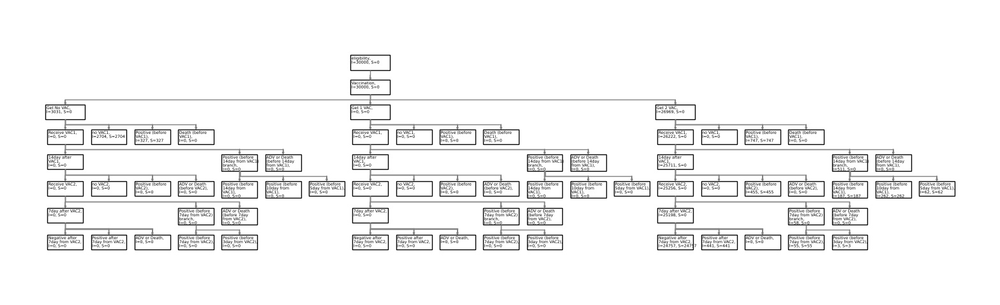

# Diagram Report

| name | info (some information omitted in md file) | up | down |
| --- | --- | --- | --- |
| eligibility | I=30000, S=0 |  | [Vaccination](#_0) |
| Vaccination | I=30000, S=0 | [eligibility](#) | [Get No VAC](#_0_0), [Get 1 VAC](#_0_1), [Get 2 VAC](#_0_2) |
| Get No VAC | I=3031, S=0 | [Vaccination](#_0) | [Receive VAC1](#_0_0_0), [no VAC1](#_0_0_1), [Positive (before VAC1)](#_0_0_2), [Death (before VAC1)](#_0_0_3) |
| Get 1 VAC | I=0, S=0 | [Vaccination](#_0) | [Receive VAC1](#_0_1_0), [no VAC1](#_0_1_1), [Positive (before VAC1)](#_0_1_2), [Death (before VAC1)](#_0_1_3) |
| Get 2 VAC | I=26969, S=0 | [Vaccination](#_0) | [Receive VAC1](#_0_2_0), [no VAC1](#_0_2_1), [Positive (before VAC1)](#_0_2_2), [Death (before VAC1)](#_0_2_3) |
| Receive VAC1 | I=0, S=0 | [Get No VAC](#_0_0) | [14day after VAC1](#_0_0_0_0), [Positive (before 14day from VAC1) branch](#_0_0_0_1), [ADV or Death (before 14day from VAC1)](#_0_0_0_2) |
| no VAC1 | I=2704, S=2704 | [Get No VAC](#_0_0) |  |
| Positive (before VAC1) | I=327, S=327 | [Get No VAC](#_0_0) |  |
| Death (before VAC1) | I=0, S=0 | [Get No VAC](#_0_0) |  |
| Receive VAC1 | I=0, S=0 | [Get 1 VAC](#_0_1) | [14day after VAC1](#_0_1_0_0), [Positive (before 14day from VAC1) branch](#_0_1_0_1), [ADV or Death (before 14day from VAC1)](#_0_1_0_2) |
| no VAC1 | I=0, S=0 | [Get 1 VAC](#_0_1) |  |
| Positive (before VAC1) | I=0, S=0 | [Get 1 VAC](#_0_1) |  |
| Death (before VAC1) | I=0, S=0 | [Get 1 VAC](#_0_1) |  |
| Receive VAC1 | I=26222, S=0 | [Get 2 VAC](#_0_2) | [14day after VAC1](#_0_2_0_0), [Positive (before 14day from VAC1) branch](#_0_2_0_1), [ADV or Death (before 14day from VAC1)](#_0_2_0_2) |
| no VAC1 | I=0, S=0 | [Get 2 VAC](#_0_2) |  |
| Positive (before VAC1) | I=747, S=747 | [Get 2 VAC](#_0_2) |  |
| Death (before VAC1) | I=0, S=0 | [Get 2 VAC](#_0_2) |  |
| 14day after VAC1 | I=0, S=0 | [Receive VAC1](#_0_0_0) | [Receive VAC2](#_0_0_0_0_0), [no VAC2](#_0_0_0_0_1), [Positive (before VAC2)](#_0_0_0_0_2), [ADV or Death (before VAC2)](#_0_0_0_0_3) |
| Positive (before 14day from VAC1) branch | I=0, S=0 | [Receive VAC1](#_0_0_0) | [Positive (before 14day from VAC1)](#_0_0_0_1_0), [Positive (before 10day from VAC1)](#_0_0_0_1_1), [Positive (before 5day from VAC1)](#_0_0_0_1_2) |
| ADV or Death (before 14day from VAC1) | I=0, S=0 | [Receive VAC1](#_0_0_0) |  |
| 14day after VAC1 | I=0, S=0 | [Receive VAC1](#_0_1_0) | [Receive VAC2](#_0_1_0_0_0), [no VAC2](#_0_1_0_0_1), [Positive (before VAC2)](#_0_1_0_0_2), [ADV or Death (before VAC2)](#_0_1_0_0_3) |
| Positive (before 14day from VAC1) branch | I=0, S=0 | [Receive VAC1](#_0_1_0) | [Positive (before 14day from VAC1)](#_0_1_0_1_0), [Positive (before 10day from VAC1)](#_0_1_0_1_1), [Positive (before 5day from VAC1)](#_0_1_0_1_2) |
| ADV or Death (before 14day from VAC1) | I=0, S=0 | [Receive VAC1](#_0_1_0) |  |
| 14day after VAC1 | I=25711, S=0 | [Receive VAC1](#_0_2_0) | [Receive VAC2](#_0_2_0_0_0), [no VAC2](#_0_2_0_0_1), [Positive (before VAC2)](#_0_2_0_0_2), [ADV or Death (before VAC2)](#_0_2_0_0_3) |
| Positive (before 14day from VAC1) branch | I=511, S=0 | [Receive VAC1](#_0_2_0) | [Positive (before 14day from VAC1)](#_0_2_0_1_0), [Positive (before 10day from VAC1)](#_0_2_0_1_1), [Positive (before 5day from VAC1)](#_0_2_0_1_2) |
| ADV or Death (before 14day from VAC1) | I=0, S=0 | [Receive VAC1](#_0_2_0) |  |
| Receive VAC2 | I=0, S=0 | [14day after VAC1](#_0_0_0_0) | [7day after VAC2](#_0_0_0_0_0_0), [Positive (before 7day from VAC2) branch](#_0_0_0_0_0_1), [ADV or Death (before 7day from VAC2)](#_0_0_0_0_0_2) |
| no VAC2 | I=0, S=0 | [14day after VAC1](#_0_0_0_0) |  |
| Positive (before VAC2) | I=0, S=0 | [14day after VAC1](#_0_0_0_0) |  |
| ADV or Death (before VAC2) | I=0, S=0 | [14day after VAC1](#_0_0_0_0) |  |
| Positive (before 14day from VAC1) | I=0, S=0 | [Positive (before 14day from VAC1) branch](#_0_0_0_1) |  |
| Positive (before 10day from VAC1) | I=0, S=0 | [Positive (before 14day from VAC1) branch](#_0_0_0_1) |  |
| Positive (before 5day from VAC1) | I=0, S=0 | [Positive (before 14day from VAC1) branch](#_0_0_0_1) |  |
| Receive VAC2 | I=0, S=0 | [14day after VAC1](#_0_1_0_0) | [7day after VAC2](#_0_1_0_0_0_0), [Positive (before 7day from VAC2) branch](#_0_1_0_0_0_1), [ADV or Death (before 7day from VAC2)](#_0_1_0_0_0_2) |
| no VAC2 | I=0, S=0 | [14day after VAC1](#_0_1_0_0) |  |
| Positive (before VAC2) | I=0, S=0 | [14day after VAC1](#_0_1_0_0) |  |
| ADV or Death (before VAC2) | I=0, S=0 | [14day after VAC1](#_0_1_0_0) |  |
| Positive (before 14day from VAC1) | I=0, S=0 | [Positive (before 14day from VAC1) branch](#_0_1_0_1) |  |
| Positive (before 10day from VAC1) | I=0, S=0 | [Positive (before 14day from VAC1) branch](#_0_1_0_1) |  |
| Positive (before 5day from VAC1) | I=0, S=0 | [Positive (before 14day from VAC1) branch](#_0_1_0_1) |  |
| Receive VAC2 | I=25256, S=0 | [14day after VAC1](#_0_2_0_0) | [7day after VAC2](#_0_2_0_0_0_0), [Positive (before 7day from VAC2) branch](#_0_2_0_0_0_1), [ADV or Death (before 7day from VAC2)](#_0_2_0_0_0_2) |
| no VAC2 | I=0, S=0 | [14day after VAC1](#_0_2_0_0) |  |
| Positive (before VAC2) | I=455, S=455 | [14day after VAC1](#_0_2_0_0) |  |
| ADV or Death (before VAC2) | I=0, S=0 | [14day after VAC1](#_0_2_0_0) |  |
| Positive (before 14day from VAC1) | I=187, S=187 | [Positive (before 14day from VAC1) branch](#_0_2_0_1) |  |
| Positive (before 10day from VAC1) | I=262, S=262 | [Positive (before 14day from VAC1) branch](#_0_2_0_1) |  |
| Positive (before 5day from VAC1) | I=62, S=62 | [Positive (before 14day from VAC1) branch](#_0_2_0_1) |  |
| 7day after VAC2 | I=0, S=0 | [Receive VAC2](#_0_0_0_0_0) | [Negative after 7day from VAC2](#_0_0_0_0_0_0_0), [Positive after 7day from VAC2](#_0_0_0_0_0_0_1), [ADV or Death](#_0_0_0_0_0_0_2) |
| Positive (before 7day from VAC2) branch | I=0, S=0 | [Receive VAC2](#_0_0_0_0_0) | [Positive (before 7day from VAC2)](#_0_0_0_0_0_1_0), [Positive (before 3day from VAC2)](#_0_0_0_0_0_1_1) |
| ADV or Death (before 7day from VAC2) | I=0, S=0 | [Receive VAC2](#_0_0_0_0_0) |  |
| 7day after VAC2 | I=0, S=0 | [Receive VAC2](#_0_1_0_0_0) | [Negative after 7day from VAC2](#_0_1_0_0_0_0_0), [Positive after 7day from VAC2](#_0_1_0_0_0_0_1), [ADV or Death](#_0_1_0_0_0_0_2) |
| Positive (before 7day from VAC2) branch | I=0, S=0 | [Receive VAC2](#_0_1_0_0_0) | [Positive (before 7day from VAC2)](#_0_1_0_0_0_1_0), [Positive (before 3day from VAC2)](#_0_1_0_0_0_1_1) |
| ADV or Death (before 7day from VAC2) | I=0, S=0 | [Receive VAC2](#_0_1_0_0_0) |  |
| 7day after VAC2 | I=25198, S=0 | [Receive VAC2](#_0_2_0_0_0) | [Negative after 7day from VAC2](#_0_2_0_0_0_0_0), [Positive after 7day from VAC2](#_0_2_0_0_0_0_1), [ADV or Death](#_0_2_0_0_0_0_2) |
| Positive (before 7day from VAC2) branch | I=58, S=0 | [Receive VAC2](#_0_2_0_0_0) | [Positive (before 7day from VAC2)](#_0_2_0_0_0_1_0), [Positive (before 3day from VAC2)](#_0_2_0_0_0_1_1) |
| ADV or Death (before 7day from VAC2) | I=0, S=0 | [Receive VAC2](#_0_2_0_0_0) |  |
| Negative after 7day from VAC2 | I=0, S=0 | [7day after VAC2](#_0_0_0_0_0_0) |  |
| Positive after 7day from VAC2 | I=0, S=0 | [7day after VAC2](#_0_0_0_0_0_0) |  |
| ADV or Death | I=0, S=0 | [7day after VAC2](#_0_0_0_0_0_0) |  |
| Positive (before 7day from VAC2) | I=0, S=0 | [Positive (before 7day from VAC2) branch](#_0_0_0_0_0_1) |  |
| Positive (before 3day from VAC2) | I=0, S=0 | [Positive (before 7day from VAC2) branch](#_0_0_0_0_0_1) |  |
| Negative after 7day from VAC2 | I=0, S=0 | [7day after VAC2](#_0_1_0_0_0_0) |  |
| Positive after 7day from VAC2 | I=0, S=0 | [7day after VAC2](#_0_1_0_0_0_0) |  |
| ADV or Death | I=0, S=0 | [7day after VAC2](#_0_1_0_0_0_0) |  |
| Positive (before 7day from VAC2) | I=0, S=0 | [Positive (before 7day from VAC2) branch](#_0_1_0_0_0_1) |  |
| Positive (before 3day from VAC2) | I=0, S=0 | [Positive (before 7day from VAC2) branch](#_0_1_0_0_0_1) |  |
| Negative after 7day from VAC2 | I=24757, S=24757 | [7day after VAC2](#_0_2_0_0_0_0) |  |
| Positive after 7day from VAC2 | I=441, S=441 | [7day after VAC2](#_0_2_0_0_0_0) |  |
| ADV or Death | I=0, S=0 | [7day after VAC2](#_0_2_0_0_0_0) |  |
| Positive (before 7day from VAC2) | I=55, S=55 | [Positive (before 7day from VAC2) branch](#_0_2_0_0_0_1) |  |
| Positive (before 3day from VAC2) | I=3, S=3 | [Positive (before 7day from VAC2) branch](#_0_2_0_0_0_1) |  |

