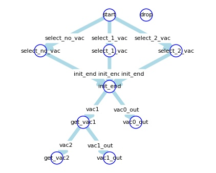
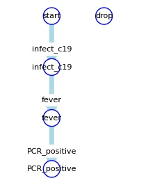
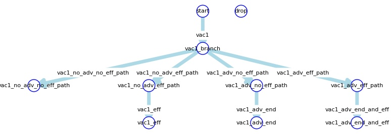

# Model Report

## sm\_vac

| trigger | state (from) | state (to) | event name | event formula |
| --- | --- | --- | --- | --- |
| select\_no\_vac | [start](#sm_vac_start) | [select\_no\_vac](#sm_vac_select_no_vac) | select\_no\_vac | [select\_no\_vac](#select_no_vac) |
| select\_1\_vac | [start](#sm_vac_start) | [select\_1\_vac](#sm_vac_select_1_vac) | select\_1\_vac | [select\_1\_vac](#select_1_vac) |
| select\_2\_vac | [start](#sm_vac_start) | [select\_2\_vac](#sm_vac_select_2_vac) | select\_2\_vac | [select\_2\_vac](#select_2_vac) |
| init\_end | [select\_no\_vac](#sm_vac_select_no_vac) | [init\_end](#sm_vac_init_end) | ev\_init\_end | [ev\_init\_end](#ev_init_end) |
| init\_end | [select\_1\_vac](#sm_vac_select_1_vac) | [init\_end](#sm_vac_init_end) | ev\_init\_end | [ev\_init\_end](#ev_init_end) |
| init\_end | [select\_2\_vac](#sm_vac_select_2_vac) | [init\_end](#sm_vac_init_end) | ev\_init\_end | [ev\_init\_end](#ev_init_end) |
| vac1 | [init\_end](#sm_vac_init_end) | [get\_vac1](#sm_vac_get_vac1) | vac1 | [vac1](#vac1) |
| vac0\_out | [init\_end](#sm_vac_init_end) | [vac0\_out](#sm_vac_vac0_out) | (infect\_c19|vac0\_out) | ([infect\_c19](#infect_c19)|[vac0\_out](#vac0_out)) |
| vac2 | [get\_vac1](#sm_vac_get_vac1) | [get\_vac2](#sm_vac_get_vac2) | vac2 | [vac2](#vac2) |
| vac1\_out | [get\_vac1](#sm_vac_get_vac1) | [vac1\_out](#sm_vac_vac1_out) | (infect\_c19|vac1\_out) | ([infect\_c19](#infect_c19)|[vac1\_out](#vac1_out)) |

## sm\_infect

| trigger | state (from) | state (to) | event name | event formula |
| --- | --- | --- | --- | --- |
| infect\_c19 | [start](#sm_infect_start) | [infect\_c19](#sm_infect_infect_c19) | infect\_c19 | [infect\_c19](#infect_c19) |
| fever | [infect\_c19](#sm_infect_infect_c19) | [fever](#sm_infect_fever) | fever | [fever](#fever) |
| PCR\_positive | [fever](#sm_infect_fever) | [PCR\_positive](#sm_infect_PCR_positive) | PCR\_positive | [PCR\_positive](#PCR_positive) |

## sm\_vac1\_eff

| trigger | state (from) | state (to) | event name | event formula |
| --- | --- | --- | --- | --- |
| vac1 | [start](#sm_vac1_eff_start) | [vac1\_branch](#sm_vac1_eff_vac1_branch) | get\_vac1 | [get\_vac1](#get_vac1) |
| vac1\_no\_adv\_no\_eff\_path | [vac1\_branch](#sm_vac1_eff_vac1_branch) | [vac1\_no\_adv\_no\_eff\_path](#sm_vac1_eff_vac1_no_adv_no_eff_path) | vac1\_no\_adv\_no\_eff\_path | [vac1\_no\_adv\_no\_eff\_path](#vac1_no_adv_no_eff_path) |
| vac1\_no\_adv\_eff\_path | [vac1\_branch](#sm_vac1_eff_vac1_branch) | [vac1\_no\_adv\_eff\_path](#sm_vac1_eff_vac1_no_adv_eff_path) | vac1\_no\_adv\_eff\_path | [vac1\_no\_adv\_eff\_path](#vac1_no_adv_eff_path) |
| vac1\_adv\_no\_eff\_path | [vac1\_branch](#sm_vac1_eff_vac1_branch) | [vac1\_adv\_no\_eff\_path](#sm_vac1_eff_vac1_adv_no_eff_path) | vac1\_adv\_no\_eff\_path | [vac1\_adv\_no\_eff\_path](#vac1_adv_no_eff_path) |
| vac1\_adv\_eff\_path | [vac1\_branch](#sm_vac1_eff_vac1_branch) | [vac1\_adv\_eff\_path](#sm_vac1_eff_vac1_adv_eff_path) | vac1\_adv\_eff\_path | [vac1\_adv\_eff\_path](#vac1_adv_eff_path) |
| vac1\_eff | [vac1\_no\_adv\_eff\_path](#sm_vac1_eff_vac1_no_adv_eff_path) | [vac1\_eff](#sm_vac1_eff_vac1_eff) | vac1\_eff | [vac1\_eff](#vac1_eff) |
| vac1\_adv\_end | [vac1\_adv\_no\_eff\_path](#sm_vac1_eff_vac1_adv_no_eff_path) | [vac1\_adv\_end](#sm_vac1_eff_vac1_adv_end) | vac1\_adv\_end | [vac1\_adv\_end](#vac1_adv_end) |
| vac1\_adv\_end\_and\_eff | [vac1\_adv\_eff\_path](#sm_vac1_eff_vac1_adv_eff_path) | [vac1\_adv\_end\_and\_eff](#sm_vac1_eff_vac1_adv_end_and_eff) | vac1\_adv\_end\_and\_eff | [vac1\_adv\_end\_and\_eff](#vac1_adv_end_and_eff) |

## sm\_vac2\_eff

| trigger | state (from) | state (to) | event name | event formula |
| --- | --- | --- | --- | --- |
| vac2 | [start](#sm_vac2_eff_start) | [vac2\_branch](#sm_vac2_eff_vac2_branch) | get\_vac2 | [get\_vac2](#get_vac2) |
| vac2\_no\_adv\_no\_eff\_path | [vac2\_branch](#sm_vac2_eff_vac2_branch) | [vac2\_no\_adv\_no\_eff\_path](#sm_vac2_eff_vac2_no_adv_no_eff_path) | vac2\_no\_adv\_no\_eff\_path | [vac2\_no\_adv\_no\_eff\_path](#vac2_no_adv_no_eff_path) |
| vac2\_no\_adv\_eff\_path | [vac2\_branch](#sm_vac2_eff_vac2_branch) | [vac2\_no\_adv\_eff\_path](#sm_vac2_eff_vac2_no_adv_eff_path) | vac2\_no\_adv\_eff\_path | [vac2\_no\_adv\_eff\_path](#vac2_no_adv_eff_path) |
| vac2\_adv\_no\_eff\_path | [vac2\_branch](#sm_vac2_eff_vac2_branch) | [vac2\_adv\_no\_eff\_path](#sm_vac2_eff_vac2_adv_no_eff_path) | vac2\_adv\_no\_eff\_path | [vac2\_adv\_no\_eff\_path](#vac2_adv_no_eff_path) |
| vac2\_adv\_eff\_path | [vac2\_branch](#sm_vac2_eff_vac2_branch) | [vac2\_adv\_eff\_path](#sm_vac2_eff_vac2_adv_eff_path) | vac2\_adv\_eff\_path | [vac2\_adv\_eff\_path](#vac2_adv_eff_path) |
| vac2\_eff | [vac2\_no\_adv\_eff\_path](#sm_vac2_eff_vac2_no_adv_eff_path) | [vac2\_eff](#sm_vac2_eff_vac2_eff) | vac2\_eff | [vac2\_eff](#vac2_eff) |
| vac2\_adv\_end | [vac2\_adv\_no\_eff\_path](#sm_vac2_eff_vac2_adv_no_eff_path) | [vac2\_adv\_end](#sm_vac2_eff_vac2_adv_end) | vac2\_adv\_end | [vac2\_adv\_end](#vac2_adv_end) |
| vac2\_adv\_end\_and\_eff | [vac2\_adv\_eff\_path](#sm_vac2_eff_vac2_adv_eff_path) | [vac2\_adv\_end\_and\_eff](#sm_vac2_eff_vac2_adv_end_and_eff) | vac2\_adv\_end\_and\_eff | [vac2\_adv\_end\_and\_eff](#vac2_adv_end_and_eff) |

## Event

| event name | event type | event info (some information omitted in md file) |
| --- | --- | --- |
| infect\_c19 | StochasticEvent |  |
| fever | TimerEvent |  |
| PCR\_positive | DummyEvent |  |
| select\_no\_vac | RandomEventChild |  |
| select\_1\_vac | RandomEventChild |  |
| select\_2\_vac | RandomEventChild |  |
| ev\_init\_end | DummyEvent |  |
| vac1 | TimerEvent |  |
| vac2 | TimerEvent |  |
| vac0\_out | ParameterEvent |  |
| vac1\_out | ParameterEvent |  |
| get\_vac1 | StateEvent |  |
| get\_vac2 | StateEvent |  |
| vac2\_no\_adv\_no\_eff\_path | RandomEventChild |  |
| vac2\_no\_adv\_eff\_path | RandomEventChild |  |
| vac2\_adv\_no\_eff\_path | RandomEventChild |  |
| vac2\_adv\_eff\_path | RandomEventChild |  |
| vac2\_eff | TimerEvent |  |
| vac2\_adv\_end | TimerEvent |  |
| vac2\_adv\_end\_and\_eff | TimerEvent |  |
| vac1\_no\_adv\_no\_eff\_path | RandomEventChild |  |
| vac1\_no\_adv\_eff\_path | RandomEventChild |  |
| vac1\_adv\_no\_eff\_path | RandomEventChild |  |
| vac1\_adv\_eff\_path | RandomEventChild |  |
| vac1\_eff | TimerEvent |  |
| vac1\_adv\_end | TimerEvent |  |
| vac1\_adv\_end\_and\_eff | TimerEvent |  |

## State

| state machine | state name | state info and update parameter func (some information omitted in md file) |
| --- | --- | --- |
| sm\_infect | PCR\_positive |  |
| sm\_vac | get\_vac2 |  |
| sm\_vac2\_eff | vac2\_no\_adv\_no\_eff\_path |  |
| sm\_vac | vac1\_out |  |
| sm\_vac2\_eff | vac2\_no\_adv\_eff\_path |  |
| sm\_vac1\_eff | start |  |
| sm\_vac2\_eff | vac2\_adv\_no\_eff\_path |  |
| sm\_vac1\_eff | drop |  |
| sm\_vac2\_eff | vac2\_adv\_eff\_path |  |
| sm\_vac1\_eff | vac1\_branch |  |
| sm\_vac | vac0\_out |  |
| sm\_vac1\_eff | vac1\_no\_adv\_no\_eff\_path |  |
| sm\_vac2\_eff | vac2\_eff |  |
| sm\_vac | select\_no\_vac |  |
| sm\_vac2\_eff | vac2\_adv\_end |  |
| sm\_vac1\_eff | vac1\_no\_adv\_eff\_path |  |
| sm\_vac2\_eff | vac2\_branch |  |
| sm\_vac2\_eff | vac2\_adv\_end\_and\_eff |  |
| sm\_vac1\_eff | vac1\_adv\_no\_eff\_path |  |
| sm\_vac | get\_vac1 |  |
| sm\_vac1\_eff | vac1\_adv\_eff\_path |  |
| sm\_vac1\_eff | vac1\_eff |  |
| sm\_vac | init\_end |  |
| sm\_vac1\_eff | vac1\_adv\_end |  |
| sm\_vac1\_eff | vac1\_adv\_end\_and\_eff |  |
| sm\_vac | select\_2\_vac |  |
| sm\_infect | start |  |
| sm\_infect | drop |  |
| sm\_vac | select\_1\_vac |  |
| sm\_vac2\_eff | start |  |
| sm\_infect | infect\_c19 |  |
| sm\_vac | start |  |
| sm\_vac2\_eff | drop |  |
| sm\_infect | fever |  |
| sm\_vac | drop |  |

